# F5
If you're using F5 BIG-IP for syslog ingestion, consider the following:

- **Uneven TCP traffic distribution**: Even with round-robin load balancing, TCP traffic may not be evenly distributed, which can lead to overloaded instances. This can cause growing queues, delays, data loss, and potential memory or disk issues.
- **UDP limitations**: UDP is a protocol prone to data loss, and load balancers can introduce another point of data loss.
- **High Availability (HA) mode**: Running the load balancer without HA makes it a single point of failure.

**Note**: Splunk only supports SC4S. If you encounter issues related to the load balancer, please contact F5 support.

## Set up your F5 BIG-IP
F5 BIG-IP is available in both hardware and virtual editions. This documentation assumes you already have a functioning F5 instance. If you need help with your F5 instance, see [external resource](https://clouddocs.f5.com/cloud/public/v1/aws/AWS_singleNIC.html).

## Create a custom health check
F5 includes built-in monitors to track the health status of pool members. You can add a custom HTTP monitor that leverages SC4S’s health check endpoint.

The health check endpoint is available in SC4S versions 3.34.0 and later.

1. Navigate to **Local Traffic** > **Monitors** > **Create**.
2. In the General Properties section configure the following settings:

- **Type**: `HTTP`
- **Parent Monitor**: `http`

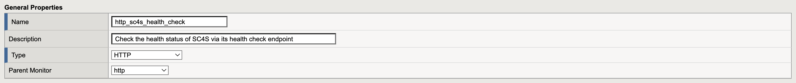

3. In the Configuration section, set **Interval** to 1 second and **Timeout** to 2 seconds, this minimizes UDP losses between health check queries.
4. Configure the following settings:

- **Send String**: `GET /health HTTP/1.0\r\n\r\n`  
- **Receive String**: `\"healthy\"`  
- **Alias Service Port**: `8080`  

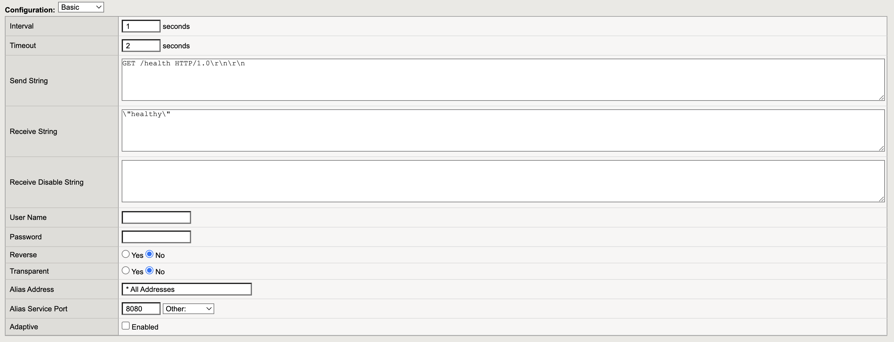


5. Click **Finished** to save.  

## Define pools 

Create a pool for each port in use. The default SC4S TCP ports are 514 and 601, and the default SC4S UDP port is 514. Separate pools are not needed for different protocols, so a single pool named "sc4s_514" can handle both TCP and UDP traffic.  

1. Navigate to **Local Traffic** > **Pools** > **Create**.  
2. Select the following health monitors:  
- "tcp"  
- "http_sc4s_health_check" ([Custom SC4S monitor](#create-a-custom-health-check))

3. Add members and click **Finished** to save the pool.  

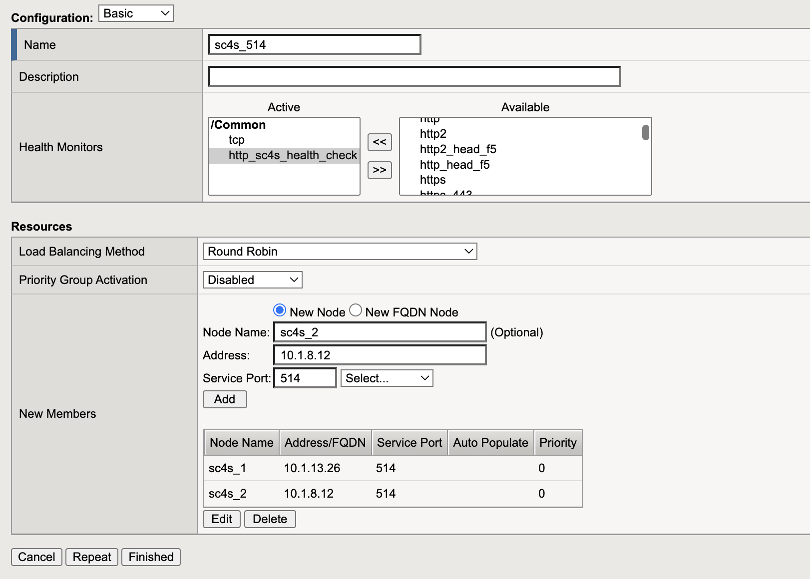  

4. Go to **Pools** > **sc4s_514** > **Members** and verify that all members have an **Active** status.  
5. (Optional) Test availability by restarting an SC4S instance:  
```bash
sudo systemctl restart sc4s
```
Observe that the member temporarily becomes unavailable.
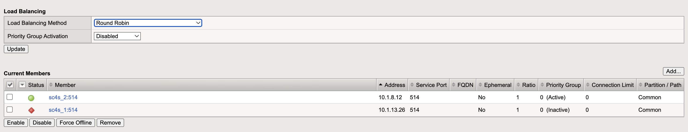

## Preserve Source IP  
In many cases, replacing the original source IP with the load balancer’s IP (typically using `automap`) is recommended. However, for syslog load balancing make sure you retain the original source IP. Otherwise, logs that do not specify a hostname in the message will appear with the load balancer's IP.  

This documentation covers two methods for preserving the source IP:  
- PROXY protocol for TCP  
- Stateless virtual server for UDP  

## TCP with PROXY  

TCP is a session-based protocol that requires acknowledgments. Load balancers typically replace the original source IP with their own to ensure that responses from the backend server are routed back to them.  

The simplest way to preserve the source IP is by using the PROXY protocol. BIG-IP does not natively support it, but it can be implemented using iRules.  

### Add the iRule
1. Navigate to **Local Traffic** > **iRules** > **Create**.  
2. Add the following iRule and save it:  
```tcl
when CLIENT_ACCEPTED {
    set proxyheader "PROXY TCP[IP::version] [IP::remote_addr] [IP::local_addr] [TCP::remote_port] [TCP::local_port]\r\n"
}
 
when SERVER_CONNECTED {
    TCP::respond $proxyheader
}
```
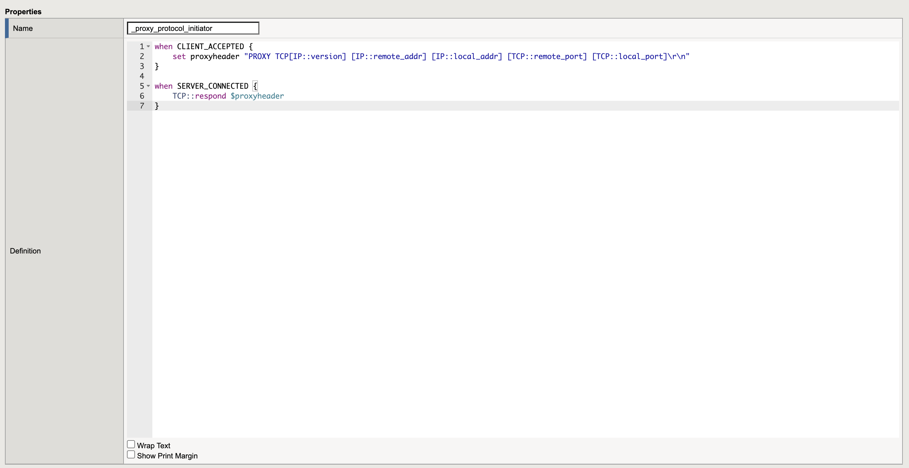

### Enable PROXY in SC4S
For each SC4S server:

1. Open the configuration file at `/opt/sc4s/env_file` and add the following line:
```conf
SC4S_SOURCE_PROXYCONNECT=yes
```

2. Restart the SC4S service: 
```bash
sudo systemctl restart sc4s
```

**Important**: Once enabled, SC4S will expect TCP input to include PROXY headers. Sending TCP messages without PROXY headers will result in the error: "Unable to determine PROXY protocol version."

### Create TCP Virtual Servers
1. Navigate to **Local Traffic** > **Virtual Servers** > **Create**.

2. In the General Properties section, configure the following settings:  
- **Type**: `Standard`  
- **Destination Address/Mask**: `<Subnet’s F5 IP>`   
- **Service Port**: `<Port to expose to sources>`  

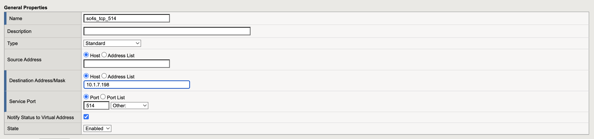

3. In the Basic Configuration section, configure the following:  
- **Protocol**: `TCP`  
- **Protocol Profile (Client)**: `tcp`  
- **Source Address Translation**: `Auto Map`  
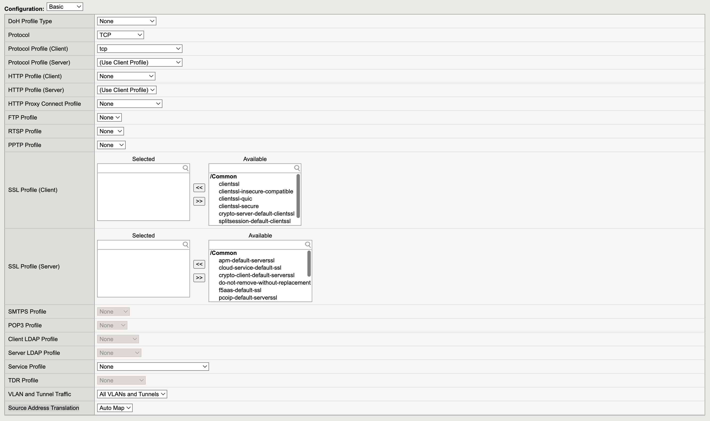

4. In the Resources section, configure the following:  
- **iRules**: `<proxy iRule>`  
- **Default Pool**: `<TCP port pool>`  

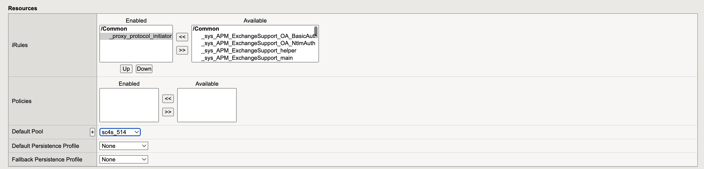

5. Click **Finished** to save your changes and start the server.

### Test your configuration
1. From an external location, send several TCP messages to your load balancer:
```bash
for i in {1..5}; do echo "$i" | nc <LB_IP> <PORT>; done
```

2. Verify that all messages reached Splunk, the host is set to the source IP (not the load balancer’s IP), and traffic is properly distributed across the pool.
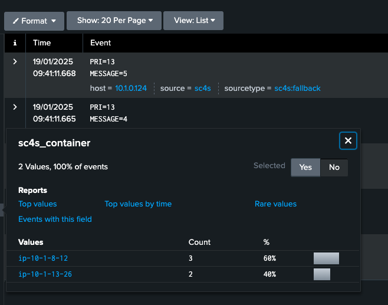

### Run performance tests
Follow the [Check TCP Performance](../performance-tests.md#check-your-tcp-performance) section. 

**Test Configuration:**  
- **Log Source**: `c5.2xlarge`  
- **SC4S Instances**: `c5.4xlarge`  
- **F5 Instance**: `r5.8xlarge, 32vCPU, 256GiB Memory, 10Gbps Network Performance`  

<small>Please note that the performance test results are based on previous versions of SC4S. We will update the results to reflect the latest SC4S version performance in the future.</small>

| Receiver                   | Performance        |
|----------------------------|--------------------|
| Single SC4S Server         | 69,192.11 msg/sec  |
| Load Balancer + 2 Servers  | 93,832.33 msg/sec  |

**Note:** Load balancer support and fine-tuning are beyond the scope of the SC4S team. For assistance in optimizing the TCP throughput of your load balancer instance, contact the F5 support team.

## Stateless Virtual Server for UDP  
UDP syslog traffic is unacknowledged and unidirectional by design. To preserve the source IP for UDP ports, configure [stateless virtual servers](https://my.f5.com/manage/s/article/K13675).

### Turn off source/destination checks
If you host your load balancer instance in a cloud environment, your provider might enforce Source/Destination IP checks. This will block traffic because the original source IP is passed through. Disable this setting.

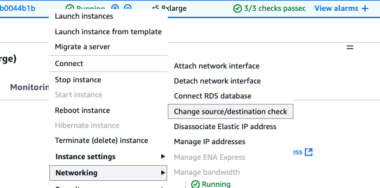

### Create a multiprocess UDP traffic profile
Configure a dedicated [UDP profile](https://my.f5.com/manage/s/article/K3605) to load balance UDP packets individually.

1. Navigate to **Local Traffic** > **Profiles**.  
2. Go to the **Protocol** tab, select **UDP**, and click **Create**.  
3. Enable the **Custom** option, then check **Datagram LB** and set **Idle Timeout** to **Immediate**.  

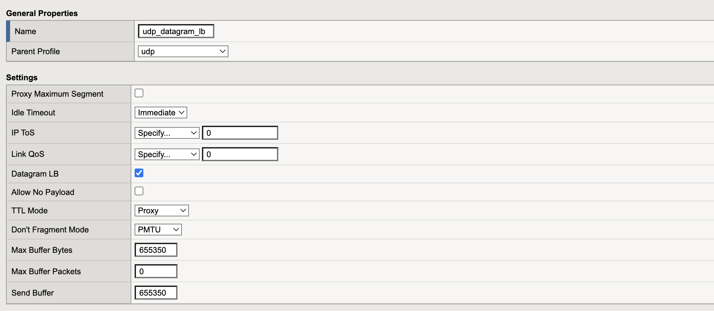

4. Click **Finished** to create the new UDP profile.  

### Create a Virtual Server  
1. Navigate to **Local Traffic** > **Virtual Servers** > **Create**.  
2. In **General Properties**, configure the following:
  
- **Type**: `Stateless`  
- **Destination Address**: Load balancer's IP  
- **Service Port**: Desired port  

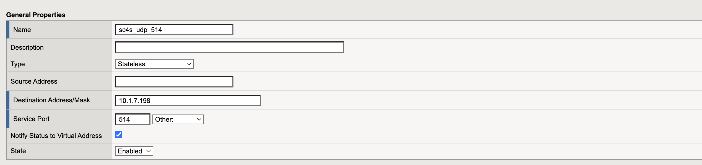

3. In the Configuration section, set:

- **Protocol Profile**: `udp_datagram_lb`  
- **Source Address Translation**: `None`  

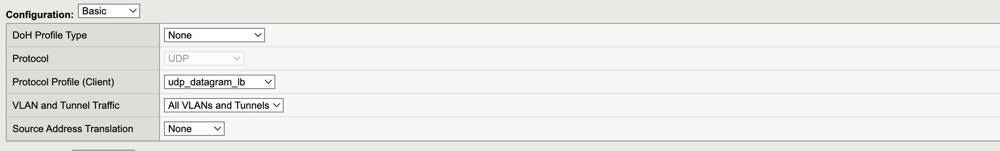

4. Select your pool and click **Finished**.  

### Test your configuration
1. From an external location, send several UDP messages to your load balancer:
```
for i in {1..5}; do echo "$i" > /dev/udp/<LB_IP>/<PORT>; done
```

2. Verify that all messages reached Splunk, the host is set to the source IP (not the load balancer’s IP), and traffic is properly distributed across the pool.

### Run performance tests
Follow the [Check UDP Performance](../performance-tests.md#check-your-udp-performance) section. 

**Test Configuration:**  
- **Log Source**: `c5.2xlarge`  
- **SC4S Instances**: `c5.4xlarge`  
- **F5 Instance**: `r5.8xlarge, 32vCPU, 256GiB Memory, 10Gbps Network Performance`  

<small>Please note that the performance test results are based on previous versions of SC4S. We will update the results to reflect the latest SC4S version performance in the future.</small>

| Receiver / Drops Rate for EPS (msgs/sec) | 4,500  | 9,000  | 27,000 | 50,000 | 150,000 |
|------------------------------------------|--------|--------|--------|--------|---------|
| Single SC4S Server                       | 0%  | 0.34%  | 58.89% | 78.30% |    92.19%   |
| Load Balancer + 2 Servers                | 0%     | 0%  | 15.66%  | 54.44% |    84.16%   |
| Single Finetuned SC4S Server             | 0%     | 0%     | 0%     | 0%     |  48.62% |
| Load Balancer + 2 Finetuned Servers      | 0%  | 0%  | 0.002%  | 0.05%  |  0.03%  |

**Note:** Load balancer support and fine-tuning are beyond the scope of the SC4S team. For assistance in minimizing UDP drops on the load balancer side, please contact the F5 support team. 
