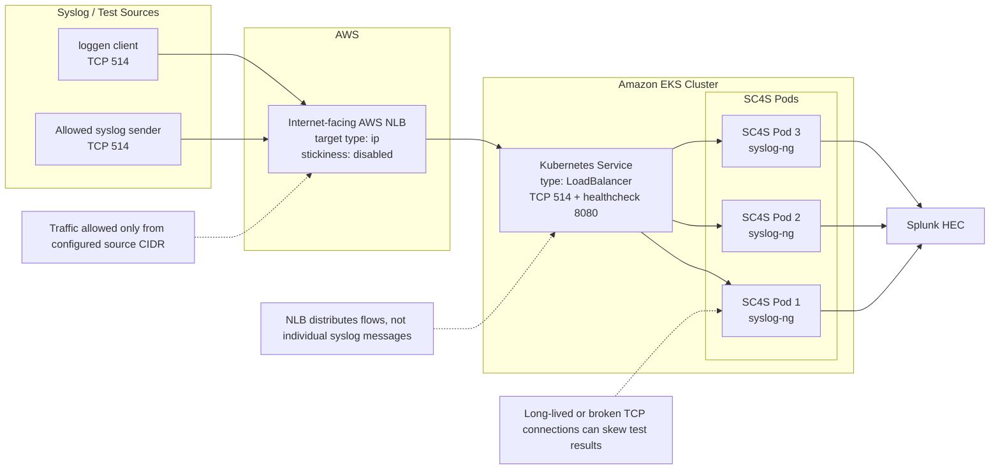

# AWS Network Load Balancer

If you choose an AWS Network Load Balancer (NLB) as a solution for SC4S on Amazon EKS, consider the following:

- **Uneven TCP traffic distribution**: NLB load balancing is flow based, not message based. A high-volume syslog sender using one long-lived TCP connection can be routed to one SC4S pod while other pods remain underused.

- **Connection lifecycle behavior**: During testing, missing events were observed when `loggen` broke or closed connections. The tested NLB Service was updated to avoid connection termination during deregistration by setting `deregistration_delay.connection_termination.enabled=false`.

- **UDP limitations**: UDP is a protocol prone to data loss, and load balancers can introduce another point of data loss.

- **Sticky sessions**: The tested configuration kept target group stickiness disabled. Source-IP stickiness was not tested because it can increase uneven distribution when many senders share the same source IP.

**Please note that Splunk only supports SC4S**. If issues arise due to AWS load balancing, Kubernetes networking, or the AWS Load Balancer Controller, please reach out to the appropriate vendor support team.

## Architecture

The tested EKS deployment path was:



## Set up EKS

Follow the AWS documentation to create an EKS cluster. The test setup used `eksctl` with an AWS CLI profile:

```bash
eksctl create cluster \
  --name <cluster-name> \
  --region <region> \
  --profile <aws-cli-profile> \
  --tags splunkit_data_classification=public,splunkit_environment_type=non-prd
```

Associate the IAM OIDC provider with the cluster:

```bash
eksctl utils associate-iam-oidc-provider \
  --region <region> \
  --cluster <cluster-name> \
  --profile <aws-cli-profile> \
  --approve
```

Create the IAM service account for the AWS Load Balancer Controller. This assumes the `AWSLoadBalancerControllerIAMPolicy` policy has already been created by following the AWS Load Balancer Controller installation guide.

```bash
eksctl create iamserviceaccount \
  --cluster <cluster-name> \
  --namespace kube-system \
  --name aws-load-balancer-controller \
  --attach-policy-arn arn:aws:iam::<account-id>:policy/AWSLoadBalancerControllerIAMPolicy \
  --override-existing-serviceaccounts \
  --region <region> \
  --approve \
  --profile <aws-cli-profile>
```

## Install AWS Load Balancer Controller

Use the [AWS Load Balancer Controller](https://kubernetes-sigs.github.io/aws-load-balancer-controller/latest/) to provision the NLB from the Kubernetes Service.

This documentation assumes:

- You already have a working EKS cluster.
- `kubectl` and `helm` are configured for that cluster.
- SC4S pods are running in the `sc4s` namespace.
- The SC4S pods have labels matching the Service selector.

!!! note "Note"
    The commands and manifests in this section reflect the tested investigation setup. Update cluster names, regions, AWS profiles, IAM policy ARNs, tags, resource requests, labels, ports, source CIDR ranges, and Splunk HEC settings to match your environment and security requirements.

Refer to the [AWS Load Balancer Controller installation guide](https://docs.aws.amazon.com/eks/latest/userguide/lbc-helm.html) for IAM and installation steps.

Install the controller:

```bash
helm repo add eks https://aws.github.io/eks-charts
helm repo update eks

helm upgrade -i aws-load-balancer-controller eks/aws-load-balancer-controller \
  -n kube-system \
  --set clusterName=<cluster-name> \
  --set serviceAccount.create=false \
  --set serviceAccount.name=aws-load-balancer-controller
```

Verify the controller:

```bash
kubectl get deployment -n kube-system aws-load-balancer-controller
kubectl get pods -n kube-system -l app.kubernetes.io/name=aws-load-balancer-controller
```

## Configure SC4S

Create the `sc4s` namespace:

```bash
kubectl create namespace sc4s
```

Create `/opt/sc4s/env_file` with the Splunk HEC settings:

```conf
SC4S_DEST_SPLUNK_HEC_DEFAULT_URL=https://<splunk-hec-host>:8088
SC4S_DEST_SPLUNK_HEC_DEFAULT_TOKEN=<hec-token>
SC4S_DEST_SPLUNK_HEC_DEFAULT_TLS_VERIFY=yes
```

Create a ConfigMap from the environment file. The name must match the Deployment's `envFrom` reference.

```bash
kubectl create configmap sc4s-env-config --from-env-file=/opt/sc4s/env_file -n sc4s
```

Deploy the SC4S sample app and NodePort Service:

`eks-sample-deployment.yaml`
```yaml
apiVersion: apps/v1
kind: Deployment
metadata:
  name: sc4s-sample-linux-deployment
  namespace: sc4s
  labels:
    app: sc4s-sample-linux-app
spec:
  replicas: 2
  selector:
    matchLabels:
      app: sc4s-sample-linux-app
  template:
    metadata:
      labels:
        app: sc4s-sample-linux-app
    spec:
      terminationGracePeriodSeconds: 900
      volumes:
        - name: config-volume
          configMap:
            name: sc4s-env-config
        # Uncomment only if local parser used
        # - name: local-filter-config
        #   configMap:
        #     name: sc4s-local-filter-config
      containers:
        - name: sc4s
          image: ghcr.io/splunk/splunk-connect-for-syslog/container3:latest
          imagePullPolicy: IfNotPresent
          resources:
            requests:
              cpu: "250m"
              memory: "512Mi"
            limits:
              cpu: "500m"
              memory: "1024Mi"
          env:
            - name: SC4S_RUNTIME_ENV
              value: "k8s"
          envFrom:
            - configMapRef:
                name: sc4s-env-config
---
apiVersion: v1
kind: Service
metadata:
  name: sc4s-nodeport-service
  namespace: sc4s
spec:
  selector:
    app: sc4s-sample-linux-app
  type: NodePort
  ports:
    - name: "udp514"
      port: 514
      targetPort: 514
      protocol: UDP
      nodePort: 30514
    - name: "tcp514"
      port: 514
      targetPort: 514
      protocol: TCP
      nodePort: 30514
    - name: "tcp601"
      port: 601
      targetPort: 601
      protocol: TCP
      nodePort: 30601
    - name: "tcp6514"
      port: 6514
      targetPort: 6514
      protocol: TCP
      nodePort: 30515
    - name: "healthcheck"
      port: 8080
      targetPort: 8080
      protocol: TCP
      nodePort: 30080
```

Apply the deployment:

```bash
kubectl apply -f eks-sample-deployment.yaml
kubectl get pods -n sc4s -o wide
kubectl get svc -n sc4s
```

!!! note "Note"
    The NLB test Service documented below exposed TCP 514 and healthcheck 8080.

## Configure autoscaling

The test setup used a HorizontalPodAutoscaler for the SC4S sample Deployment:

`hpa.yaml`
```yaml
apiVersion: autoscaling/v2
kind: HorizontalPodAutoscaler
metadata:
  name: sc4s-autoscaler
  namespace: sc4s
spec:
  scaleTargetRef:
    apiVersion: apps/v1
    kind: Deployment
    name: sc4s-sample-linux-deployment
  minReplicas: 2
  maxReplicas: 10
  metrics:
    - type: Resource
      resource:
        name: cpu
        target:
          type: Utilization
          averageUtilization: 60
  # Normally you do not want this to be so fast. This was used for testing only.
  behavior:
    scaleDown:
      stabilizationWindowSeconds: 30
      policies:
        - type: Percent
          value: 30
          periodSeconds: 15
    scaleUp:
      stabilizationWindowSeconds: 10
      policies:
        - type: Percent
          value: 80
          periodSeconds: 15
        - type: Pods
          value: 2
          periodSeconds: 15
      selectPolicy: Max
```

Apply the HPA:

```bash
kubectl apply -f hpa.yaml
kubectl get hpa -n sc4s
```

The test setup also installed the Kubernetes Cluster Autoscaler:

```bash
helm repo add autoscaler https://kubernetes.github.io/autoscaler
helm repo update

helm upgrade --install cluster-autoscaler autoscaler/cluster-autoscaler \
  --namespace kube-system \
  --set autoDiscovery.clusterName=<cluster-name> \
  --set awsRegion=<region> \
  --set rbac.create=true \
  --set extraArgs.balance-similar-node-groups=true \
  --set extraArgs.skip-nodes-with-local-storage=false \
  --set extraArgs.expander=least-waste \
  --set serviceAccount.create=true \
  --set serviceAccount.name=cluster-autoscaler
```

## Fine-tune NLB

Load balancer support and fine-tuning is outside the scope of the SC4S team's responsibility. Review the AWS documentation for [NLB target groups](https://docs.aws.amazon.com/elasticloadbalancing/latest/network/load-balancer-target-groups.html), health checks, and target group attributes before using an NLB in production.

The tested configuration used the following NLB settings:

- **Target type**: `ip`
- **Scheme**: `internet-facing`
- **Stickiness**: disabled
- **Deregistration delay**: `300` seconds
- **Connection termination after deregistration delay**: disabled
- **Access control**: `loadBalancerSourceRanges`

The deregistration settings were added after observing missing events associated with `loggen` connection breaks:

```text
stickiness.enabled=false,deregistration_delay.timeout_seconds=300,deregistration_delay.connection_termination.enabled=false
```

Use `internet-facing` instead of `internal` only when syslog sources must reach SC4S over public networking and the security model allows it.

## Preserving source IP

As a best practice, preserve or verify the original source IP of the sending device. Otherwise, logs that do not specify a hostname in the message may appear with the load balancer, node, or proxy IP. See the Kubernetes [source IP behavior](https://kubernetes.io/docs/tutorials/services/source-ip/) documentation for more information.

This investigation used:

- NLB target type `ip`
- Source allowlisting with `loadBalancerSourceRanges`
- No PROXY protocol configuration
- No source-IP sticky session configuration

Verify source IP behavior in Splunk for the specific EKS, NLB, and Service configuration before relying on source-IP based parsing, host enrichment, or compliance reporting.

### Configuration

Use the following tested Service manifest:

Set `loadBalancerSourceRanges` to the IP ranges that should be allowed to send test or syslog traffic to the NLB.

!!! note "Note"
    Treat this Service manifest as a starting point from the tested environment. Adjust the namespace, selector labels, allowed source ranges, tags, exposed ports, and NLB annotations according to your deployment model. Any change to target type, protocol mix, stickiness, or deregistration behavior should be retested before being used for production ingestion.

`load-balancer-service.yaml`
```yaml
apiVersion: v1
kind: Service
metadata:
  name: load-balancer-service
  namespace: sc4s
  labels:
    app: sc4s-load-balancer
  annotations:
    service.beta.kubernetes.io/aws-load-balancer-type: "external"
    service.beta.kubernetes.io/aws-load-balancer-nlb-target-type: "ip"
    service.beta.kubernetes.io/aws-load-balancer-scheme: "internet-facing"
    service.beta.kubernetes.io/aws-load-balancer-target-group-attributes: "stickiness.enabled=false,deregistration_delay.timeout_seconds=300,deregistration_delay.connection_termination.enabled=false"
    service.beta.kubernetes.io/aws-load-balancer-additional-resource-tags: "splunkit_data_classification=private,splunkit_environment_type=non-prd"
spec:
  type: LoadBalancer
  selector:
    app: sc4s-sample-linux-app
  ports:
    - name: healthcheck
      protocol: TCP
      port: 8080
      targetPort: 8080
    - name: tcp-port
      protocol: TCP
      port: 514
      targetPort: 514
  loadBalancerSourceRanges:
    - x.x.x.x/32
```

Apply the Service:

```bash
kubectl apply -f load-balancer-service.yaml
kubectl get svc -n sc4s load-balancer-service -o wide
kubectl describe svc -n sc4s load-balancer-service
```

## Test your configuration

Get the NLB hostname:

```bash
export TCP_NLB=$(kubectl get svc -n sc4s load-balancer-service -o jsonpath='{.status.loadBalancer.ingress[0].hostname}')
echo "$TCP_NLB"
```

Send several TCP messages:

```bash
for i in {1..5}; do echo "nlb tcp test $i" | nc -w2 "$TCP_NLB" 514; done
```

Verify in Splunk that:

- Events reached Splunk.
- The event count matches the expected test count.
- The source host or source IP is acceptable for the tested deployment.
- Events are routed to the expected index and sourcetype.

## Research findings

Based on the tested AWS NLB configuration:

- AWS NLB can be used as an EKS front end for SC4S TCP ingestion.
- The tested configuration used `ip` target mode, an internet-facing NLB, TCP 514, health check port 8080, target group stickiness disabled, and a source CIDR allowlist.
- Missing events were observed when `loggen` broke or closed connections during testing.
- The Service was updated to keep stickiness disabled and explicitly set `deregistration_delay.timeout_seconds=300` and `deregistration_delay.connection_termination.enabled=false`.
- NLB distributes TCP flows, not individual syslog messages. A small number of high-volume or long-lived TCP connections can still create uneven pod utilization.
- UDP was not part of this tested NLB configuration and should not be treated as validated by this investigation.
- Source IP behavior must be verified in Splunk for the specific EKS, NLB, and Service configuration before relying on source-IP based enrichment.

!!! note "Note"
    Load balancer support and fine-tuning is beyond the scope of the SC4S team's responsibility. For assistance with AWS NLB behavior, target group attributes, health checks, or AWS Load Balancer Controller behavior, contact AWS support.
