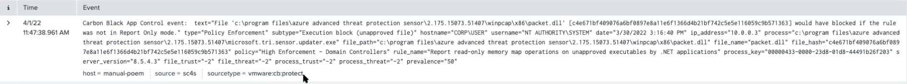

# SC4S parsers

!!! note "Prerequisites"
    Before reading this section, make sure you are familiar with [Sources](../sources/index.md).

This and subsequent sections describe how to create new parsers. SC4S parsers perform operations that would normally be performed during index time, including line-breaking, source and sourcetype setting. You can write your own parser if the parsers available in the SC4S package do not meet your needs or you want to add support for new sourcetype.

## Before you start

* Make sure you have read our [contribution standards](../CONTRIBUTING.md).
* Obtain a raw log message that you want to parse. If you do not know how to do it, refer to [Obtain raw message events](../troubleshooting/troubleshoot_resources.md#obtain-raw-message-events).
* Prepare your testing environment. With Python>=3.11.0:

```
pip3 install poetry
poetry install
```

## Parsers

### Naming conventions and project structure

Parsers are .conf files with the naming convention: `app-type-vendor_product.conf`. Parsers that are part of the repository can be found at `package/etc/conf.d/conflib` or `package/lite/etc/addons` for Lite package. If you want to add locally new parser, you can add it to `/opt/sc4s/local` directory on your existing SC4S installation.

### Parser structure

The SC4S parser consists of `application` and `block parser` blocks. The `application` part uses filter clause to specify what logs will be parsed by the `block parser` block. Example of such parser is shown below:

```
--8<---- "docs/resources/parser_development/app-syslog-vmware_cb-protect_example_basic.conf"
```

!!! note "Note"
     If you find a similar parser in SC4S, you can use it as a reference. In the parser, make sure you assign the proper sourcetype, index, vendor, product, and template. The template shows how your message should be parsed before sending them to Splunk.


The application filter will match all messages that start with the string `Carbon Black App Control event:`, and those events will be parsed by `block parser app-syslog-vmware_cb-protect()`. This parser then will route the message to index: `epintel`, set the sourcetype, source, vendor and product fields, and use speciefed template.



To learn more about creating filters and parse blocks see pages: [Filter Messages](filter_message.md) and [Parse Messages](parse_message.md).