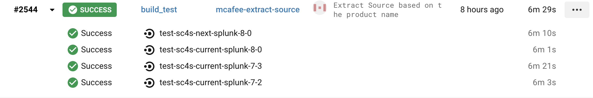
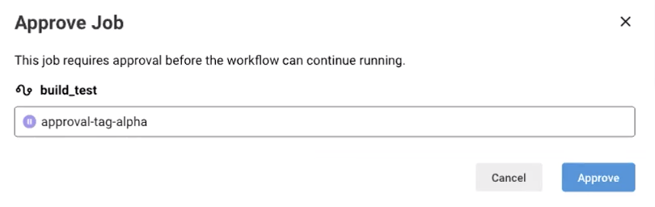
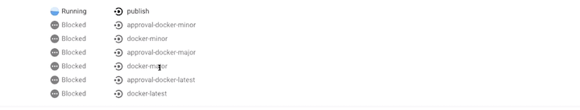

#SC4S Release Process

##Build pipeline
When a pull request is raised it goes through build tests that are automatically initiated by the Ci pipeline [CI Pipeline](https://app.circleci.com/pipelines/github/splunk/splunk-connect-for-syslog). 
Build tests consist of the testing matrix to test code with different versions of Splunk and Syslog-ng(current and next). Splunk versions currently tested are 7.3, 7.2, 8.0.
Syslog-ng versions currently tested are Syslog-ng-3.28.1 as current and its master branch as next. To catch the issues early in the development phase of the newest available Syslog-ng version.

## Filter test
The build test contains a test for each filter implemented in SC4S. Every test consists  following steps
- Test data.
- Sending test data to the host.
- Searching ingested data on splunk instance for test message based on index and host. Splunk search is testing if data ingested have the required index, timestamp and source type.
[Test Sample](https://github.com/splunk/splunk-connect-for-syslog/blob/master/tests/test_brocade.py)

## Alpha or Beta Release
Alpha or beta release creation is automated using the circle ci pipeline. This is required when we give the build to the customer for validating our enhancement/bug fix before merging it into the master branch. 
Alpha or Beta releases are merged to master usually in 1-2 days.

Tagging for Alpha release:

## Release
It will go through the build tests again for the release candidate. Tag the release with the appropriate version required.
### Release versioning 
It is following MAJOR.MINOR.PATCH for each type of release pushes the appropriate tag in the circle ci.
- MAJOR(push approval-tag-final-major)  (backward compatibility breaks)
- MINOR (push approval-tag-final-minor)
- PATCH (push approval-tag-final-patch) 

Publish the changes by approving docker minor, major, and latest so as the changes to occur in the docker images used.
