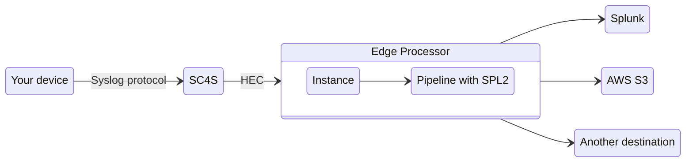

# Edge Processor integration guide (Experimental)

## Intro

`Edge Processor` can be used on that usecases:

* Enrich log message extra data (for example add some field or override index) using `SPL2`
* Filter log message using `SPL2`
* Send log messages to alternative destanations (like `AWS S3`, `Apache Kafka`, etc.)

## How it's working

## Basic Setup

 1. Use IP of EP instance as HEC URL
 2. Use token from EP Global Settings
