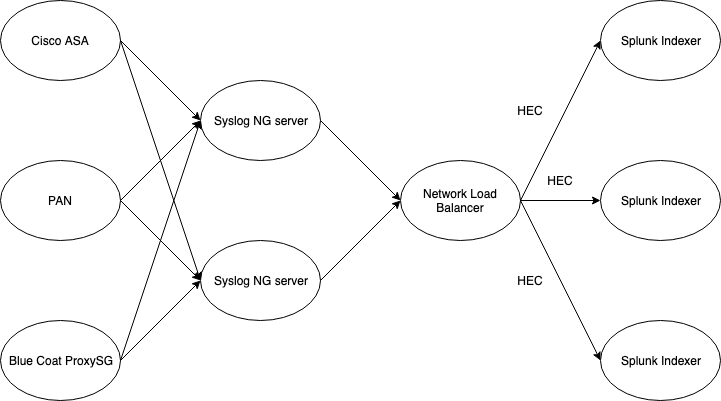

# Getting Started

Splunk Connect for Syslog is a containerized distribution of syslog-ng with a configuration framework
designed to simplify getting syslog data into Splunk Enterprise and Splunk Cloud. Our approach is
to provide a runtime-agnostic solution allowing customers to deploy using the container runtime
environment of choice.

# Planning Deployment

Syslog is an overloaded term that refers to multiple message formats AND optionally a wire protocol for
transmission of events between computer systems over UDP, TCP, or TLS. The protocol is designed to minimize
overhead on the sender favoring performance over reliability. This fundamental choice means any instability
or resource constraint will cause data to be lost in transmission.

* When practical and cost effective (considering the importance of completeness as a requirement), place the sc4s
instance in the same VLAN as the source device.

* Avoid crossing a Wireless network, WAN, Firewall, Load Balancer, or inline IDS.
* When High Availability of a single instance of SC4S is required, implement multi node clustering of the container
environment.
* Avoid TCP except where the source is unable to contain the event to a single UDP packet.
* Avoid TLS except where the event may cross a untrusted network.
* Plan for appropriately sized hardware (see)[performance.md]

# Implementation

## Splunk Setup

### Create Indexes

SC4S is pre-configured to map each sourcetype to a typical index. For new installations, it is best practice to create them in Splunk when 
using the SC4S defaults. SC4S can be easily customized to use different indexes if desired.

* email
* netauth
* netfw
* netids
* netops
* netproxy
* netipam
* em_metrics (ensure this is created as a metrics index)

### Install Related Splunk Apps

Install the following:

* [Splunk App for Infrastructure](https://splunkbase.splunk.com/app/3975/)
* [Splunk Add-on for Infrastructure](https://splunkbase.splunk.com/app/4217/)
* [Splunk Metrics Workspace](https://splunkbase.splunk.com/app/4192/) *NOTE Included in Splunk 7.3.0 and above*

### Configure the Splunk HTTP Event Collector

- Set up the Splunk HTTP Event Collector with the HEC endpoints behind a load balancer (VIP) configured for https round robin *WITHOUT* sticky
session.  Alternatively, a list of HEC endpoint URLs can be configured in SC4S (native Syslog-ng load balancing) if no load balancer is in place.  In either case, it is
recommended that SC4S traffic be sent to HEC endpoints configured directly on the indexers rather than an intermediate tier of HWFs. Deployments with 10 or fewer Indexers and where HEC is used exclusively for syslog, the recommendation is to use the native load balancing. In all other scenarios the recommendation is to use an external load balacer. If utilizing the native load balancing, be sure to update the configuration when the number and/or names of the indexers change.
- Create a HEC token that will be used by SC4S and ensure the token has access to place events in main, em_metrics, and all indexes used as
event destinations.
- Refer to [Splunk Cloud](http://docs.splunk.com/Documentation/Splunk/7.3.1/Data/UsetheHTTPEventCollector#Configure_HTTP_Event_Collector_on_managed_Splunk_Cloud)
or [Splunk Enterprise](http://dev.splunk.com/view/event-collector/SP-CAAAE6Q) for specific HEC configuration instructions based on your
Splunk type.

## Implement a Container Runtime and SC4S

### Prerequisites

* Linux host with Docker (CE 19.x or greater with Docker Swarm) or Podman enabled, depending on runtime choice (below).
* A network load balancer (NLB) configured for round robin. Note: Special consideration may be required when more advanced products are used. The optimal configuration of the load balancer will round robin each http POST request (not each connection).

### Select a Container Runtime and SC4S Configuration

| Container and Orchestration | Notes |
|-----------------------------|-------|
| [Podman + systemd single node](gettingstarted/podman-systemd-general.md) | First choice for RedHat 7.x and 8.x, second choice for Debian and Ubuntu (packages provided via PPA) |
| [Docker CE + systemd single node](gettingstarted/docker-systemd-general.md) | First choice for Debian, Ubuntu, and CentOS distributions with limited existing docker experience |
| [Docker CE + Swarm single node](gettingstarted/docker-swarm-general.md) | Option for Debian, Ubuntu, and CentOS  desiring swarm orchestration |
| [Docker CE + Swarm single node RHEL 7.7](gettingstarted/docker-swarm-rhel7.md) | Option for RedHat 7.7 desiring swarm orchestration |
| [Bring your own Envionment](gettingstarted/byoe-rhel7.md) | Option for RedHat 7.7 (centos 7) with SC4S configuration without containers | 

# Scale out

Additional hosts can be deployed for syslog collection from additional network zones and locations:

