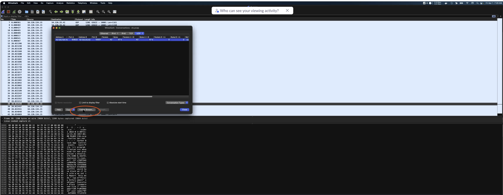
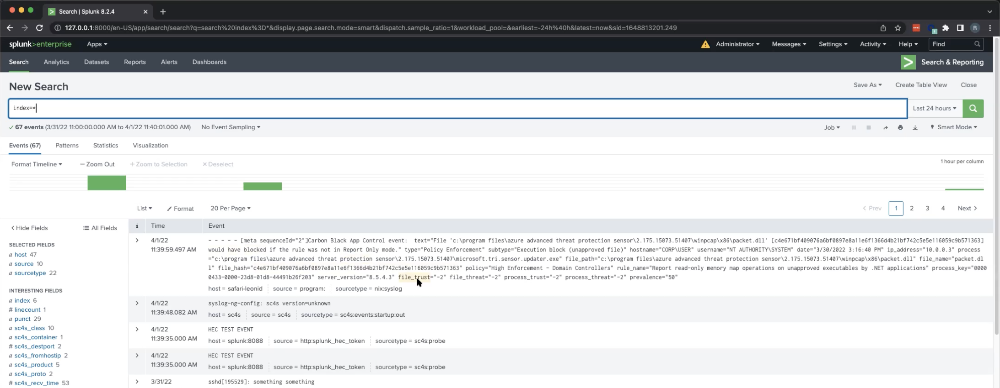
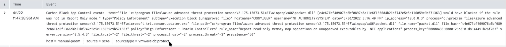

# Create a parser

SC4S parsers perform operations that would normally be performed during index time, including linebreaking, source and sourcetype setting, and timestamping. You can write your own parser if the parsers available in the SC4S package do not meet your needs.

## Before you start
* Make sure you have read our [contribution standards](../CONTRIBUTING.md).
* For more background information on how filters and parsers work, read the [sources](../sources/index.md) documentation in this manual.
* Prepare your testing [environment](../developing/index.md). With Python>=3.9:
```
pip3 install poetry
poetry install
```

* Prepare your testing command:
```
poetry run pytest -v --tb=long \
--splunk_type=external \
--splunk_hec_token=<HEC_TOKEN> \
--splunk_host=<HEC_ENDPOINT> \
--sc4s_host=<SC4S_IP> \
--junitxml=test-results/test.xml \
-n <NUMBER_OF_JOBS> \
<TEST>
```

* Create a new branch in the repository where you will apply your changes.

## Procure a raw log message
If you already have a raw log message, you can skip this step. Otherwise, you need to extract one to have something to work with. You can do this in multiple ways, this section describes three methods. 

### Procure a raw log message using `tcpdump` 
You can use the `tcpdump` command to get incoming raw messages on a given port of your server:

``` bash 
tcpdump -n -s 0 -S -i any -v port 8088

tcpdump: listening on any, link-type LINUX_SLL (Linux cooked), capture size 262144 bytes
09:54:26.051644 IP (tos 0x0, ttl 64, id 29465, offset 0, flags [DF], proto UDP (17), length 466)
10.202.22.239.41151 > 10.202.33.242.syslog: SYSLOG, length: 438
Facility local0 (16), Severity info (6)
Msg: 2022-04-28T16:16:15.466731-04:00 NTNX-21SM6M510425-B-CVM audispd[32075]: node=ntnx-21sm6m510425-b-cvm type=SYSCALL msg=audit(1651176975.464:2828209): arch=c000003e syscall=2 success=yes exit=6 a0=7f2955ac932e a1=2 a2=3e8 a3=3 items=1 ppid=29680 pid=4684 auid=1000 uid=0 gid=0 euid=0 suid=0 fsuid=0 egid=0 sgid=0 fsgid=0 tty=(none) ses=964698 comm=“sshd” exe=“/usr/sbin/sshd” subj=system_u:system_r:sshd_t:s0-s0:c0.c1023 key=“logins”\0x0a
	
```

### Procure a raw log message using Wireshark
Once you get your stream of messages, copy one of them. Note that in UDP there are not usually any message separators. 
You can also read the logs using Wireshark from the .pcap file. From Wireshark go to Statistics > Conversations, then click on 'Follow Stream':



### Procure a raw log message by saving it in Splunk

Once you get your stream of messages, copy one of them. Note that in UDP there are not usually any message separators.

See [Obtaining "On-the-wire" Raw Events](https://splunk.github.io/splunk-connect-for-syslog/main/troubleshooting/troubleshoot_resources/#obtaining-on-the-wire-raw-events).

## Create a unit test
To create a unit test, use the existing test case that is most similar to your use case. The naming convention is `test_vendor_product.py`.

1. Make sure that your log is being parsed correctly by creating a test case. 
Assuming you have a raw message like this:

`<14>1 2022-03-30T11:17:11.900862-04:00 host - - - - Carbon Black App Control event:  text="File 'c:\program files\azure advanced threat protection sensor\2.175.15073.51407\winpcap\x86\packet.dll' [c4e671bf409076a6bf0897e8a11e6f1366d4b21bf742c5e5e116059c9b571363] would have blocked if the rule was not in Report Only mode." type="Policy Enforcement" subtype="Execution block (unapproved file)" hostname="CORP\USER" username="NT AUTHORITY\SYSTEM" date="3/30/2022 3:16:40 PM" ip_address="10.0.0.3" process="c:\program files\azure advanced threat protection sensor\2.175.15073.51407\microsoft.tri.sensor.updater.exe" file_path="c:\program files\azure advanced threat protection sensor\2.175.15073.51407\winpcap\x86\packet.dll" file_name="packet.dll" file_hash="c4e671bf409076a6bf0897e8a11e6f1366d4b21bf742c5e5e116059c9b571363" policy="High Enforcement - Domain Controllers" rule_name="Report read-only memory map operations on unapproved executables by .NET applications" process_key="00000433-0000-23d8-01d8-44491b26f203" server_version="8.5.4.3" file_trust="-2" file_threat="-2" process_trust="-2" process_threat="-2" prevalence="50"`

* Make sure that the message is a valid python string, where escape characters are placed correctly.
* Anonymize the data.
* Rename functions.
* Update index and sourcetype fields.
* Extract and replace values with field names in the test string.

This example shows a test case for Vmware Carbonblack Protect device:

2. Now run the test:
...

3. The parsed log should appear in Splunk:


In this example the message is being parsed as a generic `nix:syslog` sourcetype. This means that the message format complied with RFC standards, and SC4S could correctly identify the format fields in the message.

## Create a parser
To assign your messages to the proper index and sourcetype you will need to create a parser. Your parser must be declared in `package/etc/conf.d/conflib`. The naming convention is `app-type-vendor_product.conf`.

1. If you find a similar parser in SC4S, you can use it as a reference. In the parser, make sure you assign the proper sourcetype, index, vendor, product, and template. The template shows how your message should be parsed before sending them to Splunk.

The most basic configuration will forward raw log data with correct metadata, for example:
```bash
--8<---- "docs/resources/parser_development/app-syslog-vmware_cb-protect_example_basic.conf"
```
All messages that start with the string `Carbon Black App Control event:` will now be routed to the proper index and assigned the given sourcetype:

For more info about using message filtering go to [sources documentation.](../sources/index.md#standard-syslog-using-message-parsing)

2. To apply more transformations, add the parser:
```bash
--8<---- "docs/resources/parser_development/app-syslog-vmware_cb-protect_example.conf"
```
This example extracts all fields that are nested in the raw log message first by using `csv-parser` to split `Carbon Black App Control event` and the rest of message as a two separate fields named `header` and `message`. `kv-parser` will extract all key-value pairs in the `message` field.

3. To test your parser, run a previously created test case. If you need more debugging, use `docker ps` to see your running containers and `docker logs` to see what's happening to the parsed message.

4. Commit your changes and open a pull request. 
