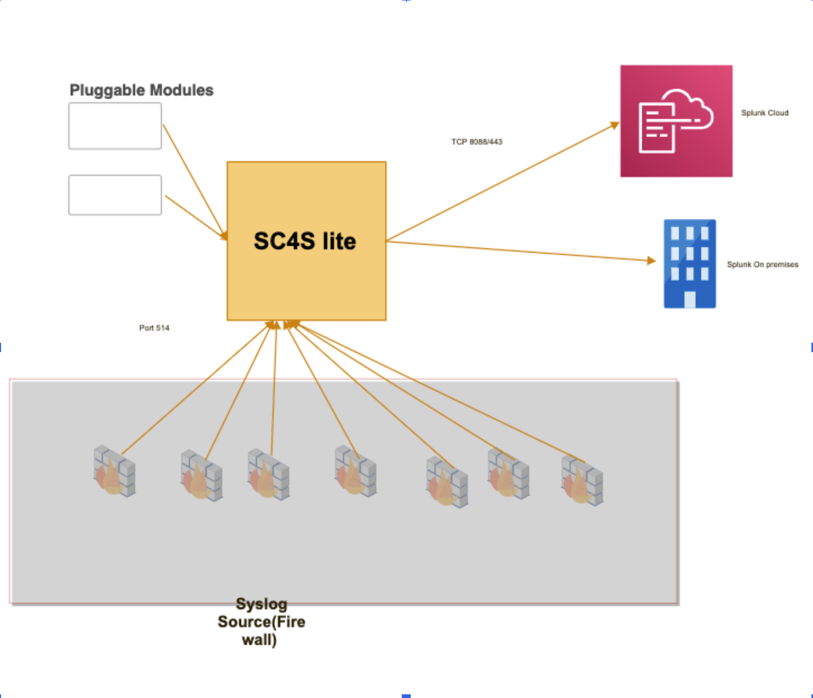

# SC4S Lite

## About SC4S Lite
SC4S Lite provides a scalable, performance-oriented solution for ingesting syslog data into Splunk. Pluggable modular parsers offer you the flexibility to incorporate custom data processing logic to suit specific use cases.

## Architecture

## Components and modules that comprise SC4S Lite 

### SC4S Lite
SC4S Lite provides a lightweight, high-performance SC4S solution.

### Pluggable Modules
Pluggable modules are predefined modules that you can enable and disable through configuration files. Each pluggable module represents a set of parsers for each vendor that supports SC4S. You can only enable or disable modules, you cannnot create new modules or update existing ones. For more information see the [pluggable modules documentation ](pluggable_modules.md).

### Splunk Enterprise or Splunk Cloud
You configure SC4S Lite to send syslog data to Splunk Enterprise or Splunk Cloud. The Splunk Platform provides comprehensive analysis, searching, and visualization of your processed data.

##  How SC4S Lite processes your data
1. Source systems send syslog data to SC4S Lite. The data may be transmitted using UDP, TCP, or RELP, depending on your system's capabilities and configurations.
2. SC4S Lite receives the syslog data and routes it through the appropriate parsers, as defined by you during configuration.
3. The parsers in the pluggable module process the data, such as parsing, filtering, and enriching the data with metadata.
4. SC4S Lite forwards the processed syslog data to the Splunk platform over the HTTP Event Collector (HEC).

## Security considerations
SC4S Lite is built on an Alpine lightweight container which has very little vulnerability. SC4S Lite supports secure syslog data transmission protocols such as RELP and TLS over TCP to protect your data in transit. Additionally, the environment in which SC4S Lite is deployed enhances data security.

## Scalability and performance
SC4S Lite provides superior performance and scalability thanks to the lightweight architecture and pluggable parsers, which distribute the processing load. It is also packaged with eBPF functionality to further enhance performance. Note that actual performance may depend on factors such as your server capacity and network bandwidth.

## Implement SC4S Lite
To implementat of SC4S Lite:

1. Set up the SC4S Lite environment.
2. Install SC4S Lite following the [instructions for your chosen environment](./gettingstarted/) with the following changes:
* In the service file for Podman or Docker replace references of standard container image (`container2` or `container3`) with `container3lite`.
* For MicroK8s replace reference to standard image in `values.yaml` file.
3. Configure source systems to send syslog data to SC4S Lite.
4. [Enable or disable](pluggable_modules.md) your pluggable modules. All pluggable modules are enabled by default.
7. Test the setup to ensure that your syslog data is correctly received, processed, and forwarded to Splunk.
