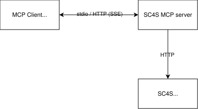

# SC4S MCP Server

!!! warning "Beta feature"
    The SC4S MCP server and AI agent plugin are beta features. They are
    currently supported only with SC4S `3.46.0`, and their interfaces may
    change between releases.

The **SC4S MCP Server** is a [Model Context Protocol](https://modelcontextprotocol.io) server
that exposes Splunk Connect for Syslog (SC4S) knowledge and a safe management
API to any MCP-compatible AI assistant or agent (for example: Cursor,
Claude Desktop, or Visual Studio Code with an MCP extension). It lets the
assistant help you discover supported vendors, author and validate
syslog-ng parsers, inspect a running SC4S instance, and apply
configuration changes through well-defined MCP tools, resources, and
prompts.

## What it is

The server is shipped as a small containerized Python application based on
[FastMCP](https://github.com/jlowin/fastmcp). It provides three categories of
capabilities:

| Category | Purpose                                                                                                                          |
|---|----------------------------------------------------------------------------------------------------------------------------------|
| **Tools** | Callable functions the assistant can invoke (for example: upload a new parser, modify environment variables, check SC4S health). |
| **Resources** | Read-only documents the assistant can load on demand (parser creation guide, troubleshooting guide, vendor docs).                |
| **Prompts** | Guided workflows (for example: `create_parser`, `troubleshoot_sc4s`) that orient the assistant to a specific task.               |

The full list of tools, resources, and prompts is documented in
[Tools](tools.md) and [Resources and prompts](resources_and_prompts.md).

## Architecture

The MCP server runs in its own OCI container (Docker or Podman) and
communicates with:

1. Your **MCP client** (the AI assistant or agent) over `stdio` on the
   local machine, or over streamable HTTP. For remote HTTP connections, configure
   [MCP server authentication](installation.md#mcp-server-authentication)
   and [TLS](installation.md#tls).
2. The **SC4S container's management API**, an HTTP REST API exposed by
   the SC4S container (default port `8080`) that handles configuration
   reads and writes for `env_file`, custom parsers, and Splunk metadata.

## Security model

!!! note "The MCP server never runs commands on the host"
    The SC4S MCP server does **not** execute shell commands, scripts, or
    binaries on your host. It does **not** invoke `docker`, `podman`,
    `systemctl`, `syslog-ng`, `bash`, or any other process outside the
    container in which it runs.

    All management actions are performed by calling a well-defined HTTP
    REST API exposed by the SC4S container itself. That API, and only
    that API, decides what configuration is accepted, validates syntax,
    and restarts `syslog-ng` inside the SC4S container when needed.

Concretely, the MCP server performs these kinds of I/O:

* **Reads** a small, read-only set of files that are baked into its own
  container image at build time: the documentation under `docs/`, the
  parser library under `package/shared/addons/`, and the parser-creator
  knowledge base. These are static; the MCP server does not reach into
  your host filesystem.
* **Makes HTTP(S) requests** to `SC4S_API_URL`, the REST API running
  inside the SC4S container. Every "management" tool is a thin wrapper
  over a single HTTP call.
* **Runs the bundled configuration generator** when `sc4s_build_config`
  is called. This tool starts `configuration-tool.sh` with `bash` inside
  the MCP container. The script generates an `env_file` preview; it does
  not execute commands on the host or modify the running SC4S instance.

Additional the shipped image:

* Runs as a non-root user (`uid 10001`), as declared in the Dockerfile
  (`USER mcp`).
* Does not mount or connect to the Docker or Podman socket; the MCP
  server has no container-management capabilities.
* The MCP server container does not require any host-filesystem bind
  mounts in its base configuration. Bind mounts are only needed when
  supplying TLS certificates (`SC4S_MCP_TLS_CERT` /
  `SC4S_MCP_TLS_KEY`), reading bearer tokens from files
  (`SC4S_MCP_AUTH_TOKEN_FILE`, `SC4S_API_TOKEN_FILE`), or trusting a
  private CA for the SC4S API (`SC4S_API_CA_CERT`). The `env_file`
  bind mount described in
  [Installation](installation.md#prepare-your-sc4s-instance) applies
  to the SC4S container, not to the MCP server container.

## Beta status and support

The SC4S MCP server is currently available as a beta feature. Use the MCP
server version that matches the SC4S version it manages; this beta release
supports SC4S `3.46.0` only. Compatibility with earlier or later SC4S versions
is not guaranteed.

Known limitations:

* Management tools require the SC4S management API to be enabled. Applying an
  `env_file` can restart SC4S, while parser and metadata changes can reload it.
* Tool schemas, prompts, and plugin workflows may change during the beta.

Beta support is provided by the SC4S community on a best-effort basis. Report
bugs through the
[SC4S GitHub issue tracker](https://github.com/splunk/splunk-connect-for-syslog/issues)
or ask for help in the SC4S community channel in Splunk Community Slack. Never
include authentication tokens, `env_file` secrets, customer data, or other
sensitive information in an issue or Slack message.

Before upgrading, record the currently deployed MCP image tag or digest and
keep the existing container configuration. Upgrade SC4S and its MCP server to
matching versions. If verification
fails, recreate the MCP container with the previously recorded image. See
[Upgrading](installation.md#upgrading) for the full
procedure.

## Next steps

* **[Installation](installation.md)**, build the image, run it with
  Docker or Podman, and configure your MCP client.
* **[Tools](tools.md)**, reference of every callable tool.
* **[Resources and prompts](resources_and_prompts.md)**, reference of
  the available MCP resources and guided prompts.
