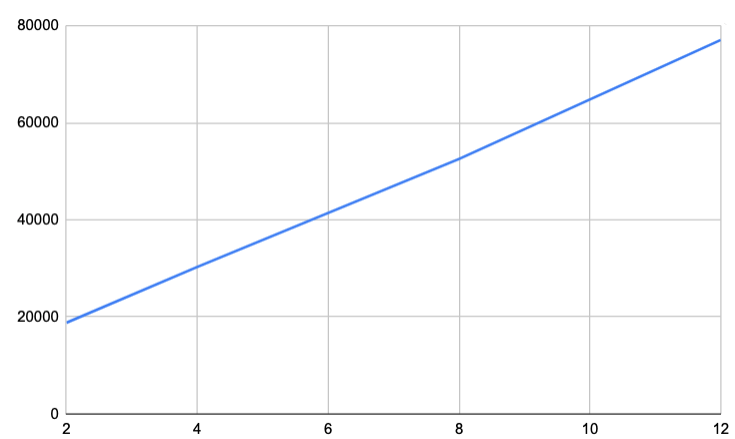

# Performance and Sizing
Performance testing against our lab configuration produces the following results and limitations. 

## Tested Configuration

* SC4S instance with 2,4,8,12 vCPU using M5zn instances
* Loggen instance m5zn.large
* Single instance Splunk using m5zn.3xlarge

## Result  

```
/opt/syslog-ng/bin/loggen -i --rate=100000 --interval=180 -P -F --sdata="[test name=\"stress17\"]" -s 800 --active-connections=10 hostname 514

# m5zn.large	2	8 GiB
average rate = 24077.33 msg/sec, count=4375116, time=181.711, (average) msg size=800, bandwidth=18810.42 kB/sec
# m5zn.xlarge	4	16 GiB
average rate = 38797.44 msg/sec, count=7028962, time=181.171, (average) msg size=800, bandwidth=30310.50 kB/sec
# m5zn.2xlarge	8	32 GiB
average rate = 67252.84 msg/sec, count=12153327, time=180.711, (average) msg size=800, bandwidth=52541.28 kB/sec
# m5zn.3xlarge	12	48 GiB
average rate = 98664.75 msg/sec, count=17834427, time=180.758, (average) msg size=800, bandwidth=77081.84 kB/sec
```



## Guidance on sizing hardware

* Though vCPU (hyper threading) was used, syslog processing is a CPU intensive task and oversubscription (sharing) of resources is not advised
* The size of the instance must be larger than the absolute peek to prevent data loss; most sources can not buffer during times of congestion
* CPU Speed is critical; slower or faster CPUs will impact throughput
* Not all sources are equal in resource utilization. Well-formed "legacy BSD" syslog messages were used in this test, but many sources are not syslog compliant and will require additional resources to process.

