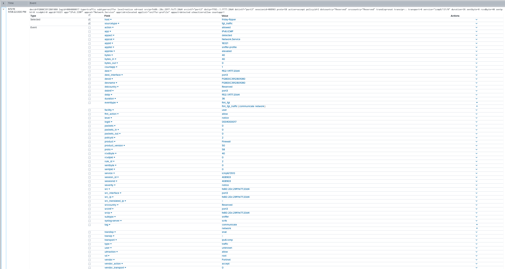

# Vendor - Checkpoint

## Product - Log Exporter (Splunk)

| Ref            | Link                                                                                                    |
|----------------|---------------------------------------------------------------------------------------------------------|
| Splunk Add-on  | https://splunkbase.splunk.com/app/4293/                                                                 |
| Product Manual | https://sc1.checkpoint.com/documents/App_for_Splunk/html_frameset.htm |


### Sourcetypes

| sourcetype     | notes                                                                                                   |
|----------------|---------------------------------------------------------------------------------------------------------|
| cp_log         | None                                                                                                    |

### Sourcetype and Index Configuration

| key            | sourcetype     | index          | notes          |
|----------------|----------------|----------------|----------------|
| checkpoint_splunk         | cp_log         | netfw          | none           |

### Source and Index Configuration

Checkpoint Software blades with CIM mapping have been sub-grouped into sources
to allow routing to appropriate indexes. All other source meta data is left at default

| key            | source     | index          | notes          |
|----------------|----------------|----------------|----------------|
| checkpoint_splunk_dlp         | dlp         | netdlp          | none           |
| checkpoint_splunk_email         | email         | email          | none           |
| checkpoint_splunk_firewall         | firewall         | netfw          | none           |
| checkpoint_splunk_sessions         | sessions         | netops          | none           |
| checkpoint_splunk_web         | web         | netproxy          | none           |

### Filter type

MSG Parse: This filter parses message content

### Setup and Configuration

* Install the Splunk Add-on on the search head(s) for the user communities interested in this data source. If SC4S is exclusively used the addon is not required on the indexer.
* Review and update the splunk_index.csv file and set the index and sourcetype as required for the data source.
* Follow vendor configuration steps per Product Manual above ensure:
    * Log Level is 6 "Informational"
    * Protocol is TCP/IP
    * permit-hostdown is on
    * device-id is hostname and included
    * timestamp is included

### Options

| Variable       | default        | description    |
|----------------|----------------|----------------|
| SC4S_LISTEN_JUNIPER_CISCO_ASA_TCP_PORT      | empty string      | Enable a TCP port for this specific vendor product using the number defined expecting RFC5424 format |
| SC4S_LISTEN_CISCO_ASA_LEGACY_TCP_PORT      | empty string      | Enable a TCP port for this specific vendor product using the number defined expecting RFC3164 format |

### Verification

Use the following search to validate events are present

```
index=<asconfigured> sourcetype=cisco:asa
```

Verify timestamp, and host values match as expected   
# Vendor - Cisco

## Product - ASA (Pre Firepower)

| Ref            | Link                                                                                                    |
|----------------|---------------------------------------------------------------------------------------------------------|
| Splunk Add-on  | https://splunkbase.splunk.com/app/1620/                                                                 |
| Product Manual | https://www.cisco.com/c/en/us/td/docs/security/asa/asa82/configuration/guide/config/monitor_syslog.html |


### Sourcetypes

| sourcetype     | notes                                                                                                   |
|----------------|---------------------------------------------------------------------------------------------------------|
| cisco:asa      | None                                                                                                    |
| cisco:pix      | Not supported                                                                                           |
| cisco:fwsm     | Not supported                                                                                           |

### Sourcetype and Index Configuration

| key            | sourcetype     | index          | notes          |
|----------------|----------------|----------------|----------------|
| cisco_asa      | cisco:asa      | netfw          | none           |


### Filter type

MSG Parse: This filter parses message content

### Setup and Configuration

* Install the Splunk Add-on on the search head(s) for the user communities interested in this data source. If SC4S is exclusively used the addon is not required on the indexer.
* Review and update the splunk_index.csv file and set the index and sourcetype as required for the data source.
* Follow vendor configuration steps per Product Manual above ensure:
    * Log Level is 6 "Informational"
    * Protocol is TCP/IP
    * permit-hostdown is on
    * device-id is hostname and included
    * timestamp is included

### Options

| Variable       | default        | description    |
|----------------|----------------|----------------|
| SC4S_LISTEN_JUNIPER_CISCO_ASA_TCP_PORT      | empty string      | Enable a TCP port for this specific vendor product using the number defined expecting RFC5424 format |
| SC4S_LISTEN_CISCO_ASA_LEGACY_TCP_PORT      | empty string      | Enable a TCP port for this specific vendor product using the number defined expecting RFC3164 format |

### Verification

Use the following search to validate events are present

```
index=<asconfigured> sourcetype=cisco:asa
```

Verify timestamp, and host values match as expected    

## Product - IOS and NX-OS based equipment

| Ref            | Link                                                                                                    |
|----------------|---------------------------------------------------------------------------------------------------------|
| Splunk Add-on  | https://splunkbase.splunk.com/app/1467/                                                                 |
| IOS Manual     | https://www.cisco.com/c/en/us/td/docs/switches/lan/catalyst2960/software/release/12-2_55_se/configuration/guide/scg_2960/swlog.html |
| NX-OS Manual   | https://www.cisco.com/c/en/us/td/docs/switches/datacenter/nexus9000/sw/6-x/system_management/configuration/guide/b_Cisco_Nexus_9000_Series_NX-OS_System_Management_Configuration_Guide/sm_5syslog.html|
| Cisco ACI      | https://community.cisco.com/legacyfs/online/attachments/document/technote-aci-syslog_external-v1.pdf |
| Cisco WLC & AP | https://www.cisco.com/c/en/us/support/docs/wireless/4100-series-wireless-lan-controllers/107252-WLC-Syslog-Server.html#anc8 |

### Sourcetypes

| sourcetype     | notes                                                                                                   |
|----------------|---------------------------------------------------------------------------------------------------------|
| cisco:ios      | This source type is also used for NX-OS, ACI and WLC product lines                                                                                                    |

### Sourcetype and Index Configuration

| key            | sourcetype     | index          | notes          |
|----------------|----------------|----------------|----------------|
| cisco_ios      | cisco:ios      | netops          | none          |
| cisco_nx_os    | cisco:ios      | netops          | none          |

### Filter type

* Cisco IOS products can be identified by message parsing alone
* Cisco NX OS, WLC, and ACI products must be identified by host or ip assignment update the filter `f_cisco_nx_os` as required


### Setup and Configuration

* Install the Splunk Add-on on the search head(s) for the user communities interested in this data source. If SC4S is exclusively used the addon is not required on the indexer.
* Review and update the splunk_index.csv file and set the index and sourcetype as required for the data source.
* IOS Follow vendor configuration steps per Product Manual above ensure:
    * Ensure a reliable NTP server is set and synced
    * Log Level is 6 "Informational"
    * Protocol is TCP/IP
    * permit-hostdown is on
    * device-id is hostname and included
    * timestamp is included
* NX-OS Follow vendor configuration steps per Product Manual above ensure:
    * Ensure a reliable NTP server is set and synced
    * Log Level is 6 "Informational" user may select alternate levels by module based on use cases
    * Protocol is TCP/IP
    * device-id is hostname and included
    * timestamp is included and milisecond accuracy selected
* ACI Logging configuration of the ACI product often varies by use case.
    * Ensure NTP sync is configured and active
    * Ensure proper host names are configured
* WLC
    * Ensure NTP sync is configured and active
    * Ensure proper host names are configured
    * For security use cases per AP logging is required

### Options

| Variable       | default        | description    |
|----------------|----------------|----------------|
| SC4S_LISTEN_CISCO_IOS_TCP_PORT      | empty string      | Enable a TCP port for this specific vendor product using the number defined |
| SC4S_LISTEN_CISCO_NX_OS_TCP_PORT      | empty string      | Enable a TCP port for this specific vendor product using the number defined |

### Verification

Use the following search to validate events are present, for NX-OS, WLC and ACI products ensure each host filter condition is verified

```
index=<asconfigured> sourcetype=cisco:ios | stats count by host
```


Verify timestamp, and host values match as expected    

# Vendor - Fortinet

## Product - Fortigate

| Ref            | Link                                                                                                    |
|----------------|---------------------------------------------------------------------------------------------------------|
| Splunk Add-on  | https://splunkbase.splunk.com/app/2846/                                                                 |
| Product Manual | https://docs.fortinet.com/product/fortigate/6.2                                                         |


### Sourcetypes

| sourcetype     | notes                                                                                                   |
|----------------|---------------------------------------------------------------------------------------------------------|
| fgt_log        | The catch all sourcetype is not used                                                                                                     |
| fgt_traffic    | None                                                                                         |
| fgt_utm        | None                                                                                          |
| fgt_event      | None


### Sourcetype and Index Configuration

| key            | sourcetype     | index          | notes          |
|----------------|----------------|----------------|----------------|
| fortinet_fortios_traffic      | fgt_traffic      | netops          | none          |
| fortinet_fortios_utm    | fgt_utm      | netids          | none          |
| fortinet_fortios_event    | fgt_event      | netops          | none          |
| fortinet_fortios_log    | fgt_log      | netops          | none          |


### Filter type

MSG Parse: This filter parses message content

### Setup and Configuration

* Install the Splunk Add-on on the search head(s) for the user communities interested in this data source. If SC4S is exclusively used the addon is not required on the indexer.
* Review and update the splunk_index.csv file and set the index and sourcetype as required for the data source.
* Refer to the admin manual for specific details of configuration to send Reliable syslog using RFC 3195 format, a typical logging configuration will include the following features.

```
config log memory filter

set forward-traffic enable

set local-traffic enable

set sniffer-traffic disable

set anomaly enable

set voip disable

set multicast-traffic enable

set dns enable

end

config system global

set cli-audit-log enable

end

config log setting

set neighbor-event enable

end

```

### Options

| Variable       | default        | description    |
|----------------|----------------|----------------|
| SC4S_LISTEN_FORTINET_FORTIOS_TCP_PORT      | empty string      | Enable a TCP port for this specific vendor product using the number defined |

### Verification

An active firewall will generate frequent events, in addition fortigate has the ability to test logging functionality using a built in command

```
diag log test
```

Verify timestamp, and host values match as expected    

```
index=<asconfigured> (sourcetype=fgt_log OR sourcetype=fgt_traffic OR sourcetype=fgt_utm)
```

### UTM Message type


### Traffic Message Type



###Event Message Type


Verify timestamp, and host values match as expected

# Vendor - Imperva

## Product - Incapsula

| Ref            | Link                                                                                                    |
|----------------|---------------------------------------------------------------------------------------------------------|
| Splunk Add-on CEF | https://bitbucket.org/SPLServices/ta-cef-for-splunk/downloads/                                                              |
| Splunk Add-on Source Specific | https://bitbucket.org/SPLServices/ta-cef-imperva-incapsula/downloads/                                                               |
| Product Manual | https://docs.imperva.com/bundle/cloud-application-security/page/more/log-configuration.htm                                                        |


### Sourcetypes

| sourcetype     | notes                                                                                                   |
|----------------|---------------------------------------------------------------------------------------------------------|
| cef        | Common sourcetype                                                                                                 |

### Source

| sourcetype     | notes                                                                                                   |
|----------------|---------------------------------------------------------------------------------------------------------|
| Imperva:Incapsula        | Common sourcetype                                                                                                 |

### Index Configuration

| key            | source     | index          | notes          |
|----------------|----------------|----------------|----------------|
| cef_Incapsula_SIEMintegration      | Imperva:Incapsula      | netwaf          | none          |

### Filter type

MSG Parse: This filter parses message content

### Options

| Variable       | default        | description    |
|----------------|----------------|----------------|
| SC4S_LISTEN_MICROFOCUS_ARCSIGHT_TCP_PORT      | empty string      | Enable a TCP port for this specific vendor product using the number defined |

### Verification

An active site will generate frequent events use the following search to check for new events

Verify timestamp, and host values match as expected    

```
index=<asconfigured> (sourcetype=cef source="Imperva:Incapsula")
```

# Vendor - Juniper

## Product - Juniper JunOS

| Ref               | Link                                                                    |
|-------------------|-------------------------------------------------------------------------|
| Splunk Add-on     | https://splunkbase.splunk.com/app/2847/                                 |
| JunOS TechLibrary | https://www.juniper.net/documentation/en_US/junos/topics/example/syslog-messages-configuring-qfx-series.html |

### Sourcetypes

| sourcetype               | notes                                                            |
|--------------------------|------------------------------------------------------------------|
| juniper:junos:firewall   | None                                                             |
| juniper:junos:idp        | None                                                             |

### Sourcetype and Index Configuration

| key                        | sourcetype             | index          | notes         |
|----------------------------|------------------------|----------------|---------------|
| juniper_junos_flow         | juniper:junos:firewall | netfw          | none          |
| juniper_junos_idp          | juniper:junos:idp      | netids         | none          |
| juniper_junos_utm          | juniper:junos:firewall | netfw          | none          |

### Filter type

* MSG Parse: This filter parses message content


### Setup and Configuration

* Install the Splunk Add-on on the search head(s) for the user communities interested in this data source. If SC4S is exclusively used the addon is not required on the indexer.
* Review and update the splunk_index.csv file and set the index as required.
* Follow vendor configuration steps per referenced Product Manual

### Options

| Variable       | default        | description    |
|----------------|----------------|----------------|
| SC4S_LISTEN_JUNIPER_JUNOS_LEGACY_TCP_PORT      | empty string      | Enable a TCP port for this specific vendor product using the number defined using legacy 3164 format|
| SC4S_LISTEN_JUNIPER_JUNOS_TCP_PORT      | empty string      | Enable a TCP port for this specific vendor product using the number defined using 5424 format |

### Verification

Use the following search to validate events are present; for Juniper JunOS ensure each host filter condition is verified

```
index=<asconfigured> sourcetype=juniper:junos:firewall | stats count by host
index=<asconfigured> sourcetype=juniper:junos:idp | stats count by host
```

Verify timestamp, and host values match as expected

## Product - Juniper NSM

| Ref            | Link                                                                    |
|----------------|-------------------------------------------------------------------------|
| Splunk Add-on  | https://splunkbase.splunk.com/app/2847/                                 |
| NSM syslog KB  | http://kb.juniper.net/InfoCenter/index?page=content&id=KB11810          |

### Sourcetypes

| sourcetype       | notes                                                                 |
|------------------|-----------------------------------------------------------------------|
| juniper:nsm      | None                                                                  |
| juniper:nsm:idp  | None                                                                  |

### Sourcetype and Index Configuration

| key                    | sourcetype          | index          | notes         |
|------------------------|---------------------|----------------|---------------|
| juniper_nsm            | juniper:nsm         | netfw          | none          |
| juniper_nsm_idp        | juniper:nsm:idp     | netids         | none          |

### Filter type

* Juniper NSM products must be identified by host or ip assignment. Update the filter `f_juniper_nsm` or `f_juniper_nsm_idp` as required


### Setup and Configuration

* Install the Splunk Add-on on the search head(s) for the user communities interested in this data source. If SC4S is exclusively used the addon is not required on the indexer.
* Review and update the splunk_index.csv file and set the index as required.
* Follow vendor configuration steps per Product Manual

### Options

| Variable       | default        | description    |
|----------------|----------------|----------------|
| SC4S_LISTEN_JUNIPER_NSM_TCP_PORT      | empty string      | Enable a TCP port for this specific vendor product using the number defined |
| SC4S_LISTEN_JUNIPER_NSM_UDP_PORT      | empty string      | Enable a TCP port for this specific vendor product using the number defined |

### Verification

Use the following search to validate events are present; for Juniper NSM ensure each host filter condition is verified

```
index=<asconfigured> sourcetype=juniper:nsm | stats count by host
index=<asconfigured> sourcetype=juniper:nsm:idp | stats count by host
```

Verify timestamp, and host values match as expected

## Product - Juniper Netscreen

| Ref            | Link                                                                                                    |
|----------------|---------------------------------------------------------------------------------------------------------|
| Splunk Add-on  | https://splunkbase.splunk.com/app/2847/                                                                 |
| Netscreen Manual   | http://kb.juniper.net/InfoCenter/index?page=content&id=KB4759                                       |

### Sourcetypes

| sourcetype              | notes                                                                                          |
|-------------------------|------------------------------------------------------------------------------------------------|
| netscreen:firewall      | None                                                                                           |
| juniper:idp             | None                                                                                           |

### Sourcetype and Index Configuration

| key                    | sourcetype          | index          | notes         |
|------------------------|---------------------|----------------|---------------|
| juniper_netscreen      | netscreen:firewall  | netfw          | none          |
| juniper_idp            | juniper:idp         | netfw          | none          |

### Filter type

* Juniper Netscreen products must be identified by host or ip assignment. Update the filter `f_juniper_netscreen` or `f_juniper_idp` as required


### Setup and Configuration

* Install the Splunk Add-on on the search head(s) for the user communities interested in this data source. If SC4S is exclusively used the addon is not required on the indexer.
* Review and update the splunk_index.csv file and set the index as required.
* Follow vendor configuration steps per Product Manual

### Options

| Variable       | default        | description    |
|----------------|----------------|----------------|
| SC4S_LISTEN_JUNIPER_NETSCREEN_TCP_PORT      | empty string      | Enable a TCP port for this specific vendor product using the number defined |
| SC4S_LISTEN_JUNIPER_NETSCREEN_UDP_PORT      | empty string      | Enable a TCP port for this specific vendor product using the number defined |

### Verification

Use the following search to validate events are present; for Juniper Netscreen products ensure each host filter condition is verified

```
index=<asconfigured> sourcetype=netscreen:firewall | stats count by host
index=<asconfigured> sourcetype=juniper:idp | stats count by host
```

Verify timestamp, and host values match as expected

## Product - Juniper SSLVPN

| Ref              | Link                                                                    |
|------------------|-------------------------------------------------------------------------|
| Splunk Add-on    | https://splunkbase.splunk.com/app/2847/                                 |
| Pulse Secure KB  | https://kb.pulsesecure.net/articles/Pulse_Secure_Article/KB22227        |

### Sourcetypes

| sourcetype       | notes                                                                 |
|------------------|-----------------------------------------------------------------------|
| juniper:sslvpn   | None                                                                  |

### Sourcetype and Index Configuration

| key                    | sourcetype          | index          | notes         |
|------------------------|---------------------|----------------|---------------|
| juniper_sslvpn         | juniper:sslvpn      | netfw          | none          |

### Filter type

* MSG Parse: This filter parses message content


### Setup and Configuration

* Install the Splunk Add-on on the search head(s) for the user communities interested in this data source. If SC4S is exclusively used the addon is not required on the indexer.
* Review and update the splunk_index.csv file and set the index as required.
* Follow vendor configuration steps per referenced Product Manual

### Options

| Variable       | default        | description    |
|----------------|----------------|----------------|
| SC4S_LISTEN_JUNIPER_JUNOS_TCP_PORT      | empty string      | Enable a TCP port for this specific vendor product using the number defined |

### Verification

Use the following search to validate events are present; for Juniper SSL VPN ensure each host filter condition is verified

```
index=<asconfigured> sourcetype=juniper:sslvpn | stats count by host
```

Verify timestamp, and host values match as expected

# Vendor - Microfocus ArcSight

## Product - Internal Agent Events

| Ref            | Link                                                                                                    |
|----------------|---------------------------------------------------------------------------------------------------------|
| Splunk Add-on CEF | https://bitbucket.org/SPLServices/ta-cef-for-splunk/downloads/                                                              |
| Product Manual | https://docs.imperva.com/bundle/cloud-application-security/page/more/log-configuration.htm                                                        |


### Sourcetypes

| sourcetype     | notes                                                                                                   |
|----------------|---------------------------------------------------------------------------------------------------------|
| cef        | Common sourcetype                                                                                                 |

### Source

| source     | notes                                                                                                   |
|----------------|---------------------------------------------------------------------------------------------------------|
| ArcSight:ArcSight        | Internal logs                                                                                               |

### Index Configuration

| key            | source     | index          | notes          |
|----------------|----------------|----------------|----------------|
| cef_ArcSight_ArcSight      | ArcSight:ArcSight      | main          | none          |

### Filter type

MSG Parse: This filter parses message content

### Options

| Variable       | default        | description    |
|----------------|----------------|----------------|
| SC4S_LISTEN_MICROFOCUS_ARCSIGHT_TCP_PORT      | empty string      | Enable a TCP port for this specific vendor product using the number defined |

### Verification

An active site will generate frequent events use the following search to check for new events

Verify timestamp, and host values match as expected    

```
index=<asconfigured> (sourcetype=cef source="ArcSight:ArcSight")
```

## Product - Microsoft Windows

| Ref            | Link                                                                                                    |
|----------------|---------------------------------------------------------------------------------------------------------|
| Splunk Add-on CEF | https://bitbucket.org/SPLServices/ta-cef-for-splunk/downloads/                                                              |
| Splunk Add-on CEF | https://bitbucket.org/SPLServices/ta-cef-microsoft-windows-for-splunk/downloads/                                                             |
| Product Manual | https://docs.imperva.com/bundle/cloud-application-security/page/more/log-configuration.htm                                                        |


### Sourcetypes

| sourcetype     | notes                                                                                                   |
|----------------|---------------------------------------------------------------------------------------------------------|
| cef        | Common sourcetype                                                                                                 |

### Source

| source     | notes                                                                                                   |
|----------------|---------------------------------------------------------------------------------------------------------|
| CEFEventLog:System or Application Event     | Windows Application and System Event Logs                                                                                  |
| CEFEventLog:Microsoft Windows     | Windows Security Event Logs                                                                                 |

### Index Configuration

| key            | source     | index          | notes          |
|----------------|----------------|----------------|----------------|
| cef_Microsoft_System or Application Event      | CEFEventLog:System or Application Event      | oswin          | none          |
| cef_Microsoft_Microsoft Windows      | CEFEventLog:Microsoft Windows      | oswinsec         | none          |

### Filter type

MSG Parse: This filter parses message content

### Options

| Variable       | default        | description    |
|----------------|----------------|----------------|
| SC4S_LISTEN_MICROFOCUS_ARCSIGHT_TCP_PORT      | empty string      | Enable a TCP port for this specific vendor product using the number defined |

### Verification

An active site will generate frequent events use the following search to check for new events

Verify timestamp, and host values match as expected    

```
index=<asconfigured> (sourcetype=cef (source="CEFEventLog:Microsoft Windows" OR source="CEFEventLog:System or Application Event"))
```

# Vendor - PaloAlto

## Product - NGFW

| Ref            | Link                                                                                                    |
|----------------|---------------------------------------------------------------------------------------------------------|
| Splunk Add-on  | https://splunkbase.splunk.com/app/2757/                                                                 |
| Product Manual | https://docs.paloaltonetworks.com/pan-os/9-0/pan-os-admin/monitoring/use-syslog-for-monitoring/configure-syslog-monitoring.html                                                         |


### Sourcetypes

| sourcetype     | notes                                                                                                   |
|----------------|---------------------------------------------------------------------------------------------------------|
| pan:log        | None                                                                                                    |
| pan:traffic    | None                                                                                         |
| pan:threat     | None                                                                                          |
| pan:system     | None                                                                                          |
| pan:config     | None                                                                                          |
| pan:hipwatch   | None                                                                                          |
| pan:correlation | None                                                                                          |

### Sourcetype and Index Configuration

| key            | sourcetype     | index          | notes          |
|----------------|----------------|----------------|----------------|
| pan_log      | pan:log       | netops          | none          |
| pan_traffic    | pan:traffic      | netfw          | none          |
| pan_threat    | pan:threat      | netproxy          | none          |
| pan_system    | pan:system      | netops          | none          |
| pan_config    | pan:config      | netops          | none          |
| pan_hipwatch    | pan:hipwatch      | netops          | none          |
| pan_correlation    | pan:correlation      | netops          | none          |

### Filter type

MSG Parse: This filter parses message content

### Setup and Configuration

* Install the Splunk Add-on on the search head(s) for the user communities interested in this data source. If SC4S is exclusively used the addon is not required on the indexer.
* Review and update the splunk_index.csv file and set the index and sourcetype as required for the data source.
* Refer to the admin manual for specific details of configuration
    * Select TCP or SSL transport option
    * Select IETF Format
    * Ensure the format of the event is not customized

### Options

| Variable       | default        | description    |
|----------------|----------------|----------------|
| SC4S_LISTEN_PALOALTO_PANOS_TCP_PORT      | empty string      | Enable a TCP port for this specific vendor product using the number defined |

### Verification

An active firewall will generate frequent events. Use the following search to validate events are present per source device

```
index=<asconfigured> sourcetype=pan:*| stats count by host
```

# Vendor - Proofpoint

## Product - Proofpoint Protection Server

| Ref            | Link                                                                                                    |
|----------------|---------------------------------------------------------------------------------------------------------|
| Splunk Add-on  | https://splunkbase.splunk.com/app/3080/                                                                 |
| Product Manual | https://proofpointcommunities.force.com/community/s/article/Remote-Syslog-Forwarding                    |


### Sourcetypes

| sourcetype     | notes                                                                                                   |
|----------------|---------------------------------------------------------------------------------------------------------|
| pps_filter_log |                                                                               |
|  pps_mail_log  | This sourcetype will conflict with sendmail itself, so will require that the PPS send syslog on a dedicated port or be uniquely identifiable with a hostname glob or CIDR block if this sourcetype is desired for PPS.   |

### Sourcetype and Index Configuration

| key            | sourcetype     | index          | notes          |
|----------------|----------------|----------------|----------------|
| proofpoint_pps_filter        | pps_filter_log       | email          | none          |
| proofpoint_pps_sendmail      | pps_mail_log       | email          | none          |


### Filter type

MSG Parse: This filter parses message content
* NOTE:  This filter will simply parse the syslog message itself, and will _not_ perform the (required) re-assembly of related
messages to create meaningful final output.  This will require follow-on processing in Splunk.

### Setup and Configuration

* Install the Splunk Add-on on the search head(s) for the user communities interested in this data source. If SC4S is exclusively used the addon is not required on the indexer.
* Review and update the splunk_index.csv file and set the index and sourcetype as required for the data source.
* Follow vendor configuration steps per referenced Product Manual

### Options

| Variable       | default        | description    |
|----------------|----------------|----------------|
| SC4S_PROOFPOINT_PPS_FILTER_TCP_PORT      | empty string      | Enable a TCP port for this specific vendor product using the number defined.   If this option is used to ensure PPS sendmail sourcetype uniqueness (see above), set the same port number for this and the SC4S_PROOFPOINT_PPS_MAIL_TCP_PORT variable immediately below.|
| SC4S_PROOFPOINT_PPS_MAIL_TCP_PORT      | empty string      | Enable a TCP port for this specific vendor product using the number defined. If this option is used to ensure PPS sendmail sourcetype uniqueness (see above), set the same port number for this and the SC4S_PROOFPOINT_PPS_FILTER_TCP_PORT variable immediately above. |

### Verification

One or two sourcetypes are included in Proofpoint PPS logs.  The search below will surface both of them:

```
index=<asconfigured> sourcetype=pps_*_log | stats count by host
```

# Vendor - Symantec

## Product - ProxySG/ASG (Bluecoat)

| Ref            | Link                                                                                                    |
|----------------|---------------------------------------------------------------------------------------------------------|
| Splunk Add-on  | https://splunkbase.splunk.com/app/2758/                                                                 |
| Product Manual | https://support.symantec.com/us/en/article.tech242216.html                                                        |


### Sourcetypes

| sourcetype     | notes                                                                                                   |
|----------------|---------------------------------------------------------------------------------------------------------|
| bluecoat:proxysg:access:kv        | Requires version TA 3.6                                                                                                    |

### Sourcetype and Index Configuration

| key            | sourcetype     | index          | notes          |
|----------------|----------------|----------------|----------------|
| bluecoat_proxy      | bluecoat:proxysg:access:kv       | netops          | none          |


### Filter type

MSG Parse: This filter parses message content

### Setup and Configuration

* Install the Splunk Add-on on the search head(s) for the user communities interested in this data source. If SC4S is exclusively used the addon is not required on the indexer.
* Review and update the splunk_index.csv file and set the index and sourcetype as required for the data source.
* Refer to the Splunk TA documentation for the specific customer format required for proxy configuration
    * Select TCP or SSL transport option
    * Ensure the format of the event is customized per Splunk documentation

### Options

| Variable       | default        | description    |
|----------------|----------------|----------------|
| SC4S_LISTEN_SYMANTEC_PROXY_TCP_PORT      | empty string      | Enable a TCP port for this specific vendor product using the number defined |

### Verification

An active proxy will generate frequent events. Use the following search to validate events are present per source device

```
index=<asconfigured> sourcetype=bluecoat:proxysg:access:kv | stats count by host
```
