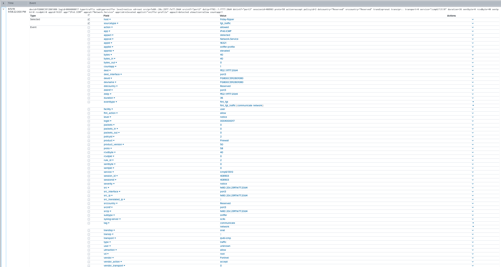

# Vendor - Fortinet

There are two Fortinet device flavors (FortiOS and Fortiweb) that are supported by a single log path
in SC4S.  Therefore, both Fortinet variants use "FORTINET" as the core of the unique port and
archive environment variable settings (rather than a unique one per product), as the Fortinet log path
handles either variant sending events to SC4S. Therefore, the FORTINET environment variables for unique
port, archive, etc. should be set only _once_, regardless of how many unique ports or Fortinet appliance
variants are in use.

If your deployment has multiple Fortinet devices that send to more than one port,
set the FORTINET unique port variable(s) to just one of the ports in use.  Then, map the others with
container networking to the port chosen, similar to the way default ports are configured (see the
"Getting Started" runtime documents for more details).

Example: If you have three Fortinet devices, sending on TCP ports 2000,2001, and 2002, set 
`SC4S_LISTEN_FORTINET_TCP_PORT=2000`.  Then, change the unit/compose files to route the three external
ports to the single port 2000 on the container. Here is the example for podman/systemd:

```
ExecStart=/usr/bin/podman -p 514:514 -p 514:514/udp -p 6514:6514 -p 2000-2002:2000 \
```

or this, for docker-compose/swarm installations:

```
# Comment the following line out if using docker-compose         
         mode: host         
       - target: 2000
         published: 2000-2002
         protocol: tcp   
```

These changes will route all three ports to TCP port 2000 inside the container, and the single Fortinet log 
path will properly process data from all three devices.

The source documentation included below includes settings for both appliance types (FortiOS and Fortigate)
supported by SC4S.

## Product - Fortigate

| Ref            | Link                                                                                                    |
|----------------|---------------------------------------------------------------------------------------------------------|
| Splunk Add-on  | https://splunkbase.splunk.com/app/2846/                                                                 |
| Product Manual | https://docs.fortinet.com/product/fortigate/6.2                                                         |


### Sourcetypes

| sourcetype     | notes                                                                                                   |
|----------------|---------------------------------------------------------------------------------------------------------|
| fgt_log        | Catch-all sourcetype; not used by the TA                                                                |
| fgt_traffic    | None                                                                                                    |
| fgt_utm        | None                                                                                                    |
| fgt_event      | None                                                                                                    |


### Sourcetype and Index Configuration

| key            | sourcetype     | index          | notes          |
|----------------|----------------|----------------|----------------|
| fortinet_fortios_traffic      | fgt_traffic      | netfw          | none          |
| fortinet_fortios_utm    | fgt_utm      | netids          | none          |
| fortinet_fortios_event    | fgt_event      | netops          | none          |
| fortinet_fortios_log    | fgt_log      | netops          | none          |


### Filter type

MSG Parse: This filter parses message content

### Setup and Configuration

* Install the Splunk Add-on on the search head(s) for the user communities interested in this data source. If SC4S is exclusively used the addon is not required on the indexer.
* Review and update the splunk_index.csv file and set the index and sourcetype as required for the data source.
* Refer to the admin manual for specific details of configuration to send Reliable syslog using RFC 3195 format, a typical logging configuration will include the following features.

```
config log memory filter

set forward-traffic enable

set local-traffic enable

set sniffer-traffic disable

set anomaly enable

set voip disable

set multicast-traffic enable

set dns enable

end

config system global

set cli-audit-log enable

end

config log setting

set neighbor-event enable

end

```

### Options

* NOTE:  Remember to set the variable(s) below only _once_, regardless of how many unique ports and/or Fortinet device types
are in use.  See the introductory note above for more details.

| Variable       | default        | description    |
|----------------|----------------|----------------|
| SC4S_LISTEN_FORTINET_TCP_PORT      | empty string      | Enable a UDP port for this specific vendor product using the number defined |
| SC4S_LISTEN_FORTINET_UDP_PORT      | empty string      | Enable a UDP port for this specific vendor product using the number defined |
| SC4S_ARCHIVE_FORTINET | no | Enable archive to disk for this specific source |
| SC4S_DEST_FORTINET_HEC | no | When Splunk HEC is disabled globally set to yes to enable this specific source | 

### Verification

An active firewall will generate frequent events, in addition fortigate has the ability to test logging functionality using a built in command

```
diag log test
```

Verify timestamp, and host values match as expected    

```
index=<asconfigured> (sourcetype=fgt_log OR sourcetype=fgt_traffic OR sourcetype=fgt_utm)
```

### UTM Message type


### Traffic Message Type



###Event Message Type


Verify timestamp, and host values match as expected

## Product - FortiWeb

| Ref            | Link                                                                                                    |
|----------------|---------------------------------------------------------------------------------------------------------|
| Splunk Add-on  | https://splunkbase.splunk.com/app/4679/                                                                 |
| Product Manual | https://docs.fortinet.com/product/fortiweb/6.3                                                         |


### Sourcetypes

| sourcetype     | notes                                                                                                   |
|----------------|---------------------------------------------------------------------------------------------------------|
| fgt_log        | Catch-all sourcetype; not used by the TA                                                                |
| fwb_traffic    | None                                                                                                    |
| fwb_attack     | None                                                                                                    |
| fwb_event      | None                                                                                                    |


### Sourcetype and Index Configuration

| key            | sourcetype     | index          | notes          |
|----------------|----------------|----------------|----------------|
| fortinet_fortiweb_traffic      | fwb_traffic      | netfw          | none          |
| fortinet_fortiweb_attack    | fwb_attack      | netids          | none          |
| fortinet_fortiweb_event    | fwb_event      | netops          | none          |
| fortinet_fortiweb_log    | fwb_log      | netops          | none          |


### Filter type

MSG Parse: This filter parses message content

### Setup and Configuration

* Install the Splunk Add-on on the search head(s) for the user communities interested in this data source. If SC4S is exclusively used the addon is not required on the indexer.
* Review and update the splunk_index.csv file and set the index and sourcetype as required for the data source.
* Refer to the admin manual for specific details of configuration to send Reliable syslog using RFC 3195 format, a typical logging configuration will include the following features.

```
config log syslog-policy

edit splunk  

config syslog-server-list 

edit 1

set server x.x.x.x

set port 514 (Example. Should be the same as default or dedicated port selected for sc4s)   

end

end

config log syslogd

set policy splunk

set status enable

end

```

### Options

* NOTE:  Remember to set the variable(s) below only _once_, regardless of how many unique ports and/or Fortinet device types
are in use.  See the introductory note above for more details.

| Variable       | default        | description    |
|----------------|----------------|----------------|
| SC4S_LISTEN_FORTINET_TCP_PORT      | empty string      | Enable a UDP port for this specific vendor product using the number defined |
| SC4S_LISTEN_FORTINET_UDP_PORT      | empty string      | Enable a UDP port for this specific vendor product using the number defined |
| SC4S_ARCHIVE_FORTINET | no | Enable archive to disk for this specific source |
| SC4S_DEST_FORTINET_HEC | no | When Splunk HEC is disabled globally set to yes to enable this specific source | 

### Verification

An active firewall will generate frequent events, in addition fortigate has the ability to test logging functionality using a built in command

```
diag log test
```

Verify timestamp, and host values match as expected    

```
index=<asconfigured> (sourcetype=fwb_log OR sourcetype=fwb_traffic OR sourcetype=fwb_attack OR sourcetype=fwb_event)
```

Verify timestamp, and host values match as expected
