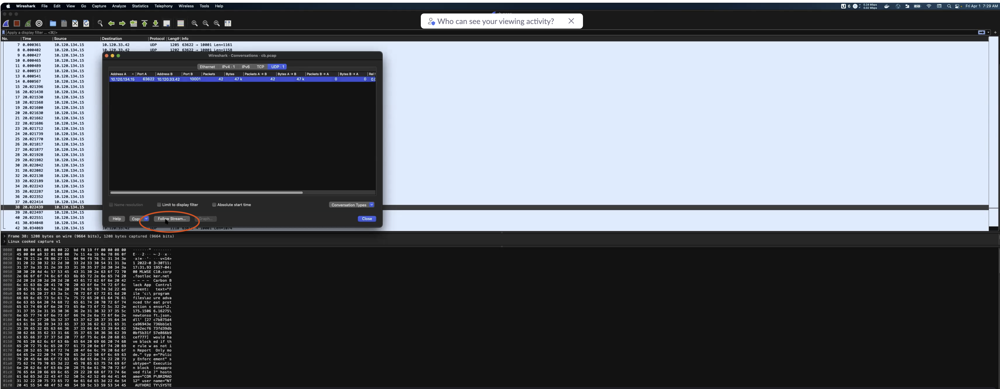

# SC4S Logging and Troubleshooting Resources

## Helpful Linux and container commands

### Linux service (systemd) commands

- Check service status: `systemctl status sc4s`
- Start service: `systemctl start service`
- Stop service: `systemctl stop service`
- Restart service: `systemctl restart service`
- Enable service at boot: `systemctl enable sc4s`
- Query the system journal: `journalctl -b -u sc4s`

### Container commands

All of the following container commands can be run with the `podman` or `docker` runtime.

- Access container logs: `sudo podman logs SC4S`
- Execute into an SC4S container: `podman exec -it SC4S bash`
- Rebuild an SC4S volume:
```
podman volume rm splunk-sc4s-var
podman volume create splunk-sc4s-var
```
- Pull an image or a repository from a registry: `podman pull ghcr.io/splunk/splunk-connect-for-syslog/container3`
- Remove unused data: `podman system prune`
- Load an image from a .tar archive or STDIN: `podman load <tar>`

### Inspect syslog-ng statistics

Use `syslog-ng-ctl stats` to determine whether SC4S is receiving messages,
routing them to a Splunk HEC destination, buffering them, or dropping them.
Run the command through the container runtime:

```bash
sudo podman exec SC4S syslog-ng-ctl stats
# or
sudo docker exec SC4S syslog-ng-ctl stats
```

The output is semicolon-delimited. A destination statistic resembles:

```text
dst.http;d_hec_fmt#0;https://splunk.example.com:8088/services/collector/event;a;queued;1250
```

The fields identify the component, configuration object, instance, state,
counter, and value. The state is normally `a` for an active object. A state of
`o` identifies an orphaned counter from an object that is no longer active.

The following counters are the most useful when troubleshooting SC4S:

| Counter | Meaning | Diagnostic value |
| --- | --- | --- |
| `queued` | Messages currently waiting in a destination queue | A queue that grows continuously indicates destination backpressure or an unavailable HEC endpoint. A temporary queue that drains can be normal during a traffic burst. |
| `dropped` | Messages permanently dropped | Any increase requires investigation. Check the container logs for a full buffer, an HTTP error, or another delivery failure. |
| `written` | Messages successfully delivered to the destination | This should increase while SC4S is receiving traffic. |
| `processed` | Messages handed to a source, parser, or destination component | At a destination, this does not prove delivery because messages can still be queued. |
| `discarded` | Messages rejected by a parser | An increasing value can identify malformed or unsupported messages. |
| `memory_usage` | Bytes occupied by the queues associated with an object | Use this with `queued` to identify increasing memory pressure from buffering. |
| `eps_last_1h` | Approximate events per second during the previous hour | Compare this with the expected traffic baseline. This counter is updated periodically rather than for every message. |

The available counters depend on the syslog-ng version and configured
statistics level. A missing optional counter such as `eps_last_1h` does not by
itself indicate a problem. See the syslog-ng documentation for the complete
[metrics and counters reference](https://syslog-ng.github.io/admin-guide/150_Statistics_of_syslog-ng/000_Metrics_and_counters.html).

For destination counters, syslog-ng calculates successfully written messages
as follows:

```text
written = processed - queued - dropped
```

`processed`, `written`, and `dropped` are cumulative counters. `queued` is the
current destination backlog. Compare samples taken several seconds apart;
counter trends are usually more useful than a single value.

To display the principal counters for every SC4S HEC destination, run:

```bash
sudo podman exec SC4S syslog-ng-ctl stats \
  | grep -E 'd_hec.*;(processed|written|queued|dropped|memory_usage|eps_last_1h|batch_size_avg);'
```

To check whether network sources are receiving messages, run:

```bash
sudo podman exec SC4S syslog-ng-ctl stats \
  | grep -E '^src\..*;(processed|connections|eps_last_1h|stamp);'
```

Use the following combinations to narrow down a data-flow problem:

| Observed trend | Likely interpretation |
| --- | --- |
| Source `processed` and HEC `written` increase, `queued` remains low or drains, and `dropped` remains unchanged | Normal data flow. |
| Source `processed` increases, HEC `written` stalls, and HEC `queued` increases | Splunk HEC, network connectivity, or downstream capacity problem. |
| Source `processed` increases but HEC `processed` does not | Parser, filter, routing, or destination-selection problem. |
| Parser `discarded` increases | The parser is rejecting some incoming messages. Obtain a raw message and check its format. |
| HEC `dropped` increases | Permanent data loss is occurring. Check SC4S logs and buffer capacity immediately. |
| Source and destination counters remain unchanged | SC4S is not receiving traffic on the expected listener, or the wrong protocol or port is being used. |
| HEC `written` increases faster than new input and `queued` decreases | SC4S is draining a backlog after a transient outage or traffic burst. |

Do not use `syslog-ng-ctl stats --reset` during an active investigation unless
you intentionally want to start a new measurement interval. Resetting the
cumulative counters removes the baseline needed to calculate changes. It does
not reset the `queued` counters.

### Check for TCP backpressure

TCP backpressure can occur in either direction: between a logging source and
SC4S, or between SC4S and Splunk HEC. Confirm it by correlating SC4S destination
queues with Linux socket queues and TCP flow-control signals.

For standard host-network SC4S deployments, inspect established connections
on the SC4S host. To check incoming syslog over TCP and TLS, run:

```bash
sudo ss -tinomp state established '( sport = :514 or sport = :601 or sport = :6514 )'
```

Replace these ports with any custom SC4S TCP or TLS listener ports. To inspect
outgoing connections from SC4S to Splunk HEC, run the command for the port used
by the HEC endpoint:

```bash
sudo ss -tinomp state established '( dport = :8088 )'
```

Use `dport = :443` instead when HEC is exposed on HTTPS port 443. The options
select TCP sockets (`-t`), internal TCP information (`-i`), numeric addresses
and ports (`-n`), timers (`-o`), socket memory (`-m`), and the owning process
(`-p`).

For an established TCP socket, the first columns are:

```text
State  Recv-Q  Send-Q  Local Address:Port  Remote Address:Port
```

The queue columns have different significance depending on the direction:

| Connection | Counter to inspect | Meaning |
| --- | --- | --- |
| Logging source to SC4S | `Recv-Q` on the SC4S host | Bytes received by the kernel but not yet read by syslog-ng. A queue that remains high or grows indicates that SC4S is not reading the connection fast enough. |
| SC4S to Splunk HEC | `Send-Q` on the SC4S host | Bytes sent by SC4S but not yet acknowledged by the downstream endpoint. A queue that remains high or grows can indicate a slow receiver, packet loss, or a constrained receive window. |

The values on a listening socket have different meanings, so use
`state established` when diagnosing data-flow backpressure. Short-lived queue
spikes are normal; compare several samples and focus on persistent growth.

The additional `ss -i` output can include the round-trip time (`rtt`),
retransmission timeout (`rto`), retransmission backoff, congestion window
(`cwnd`), acknowledged bytes, and estimated send rate. A
`timer:(persist,...)` entry is strong evidence that the remote endpoint
advertised a zero receive window and the local host is sending window probes.
Increasing retransmissions alone can indicate packet loss rather than
application backpressure.

If `tshark` is installed, use packet analysis to confirm zero-window events,
receiver-window-full conditions, or retransmissions:

For details about how syslog-ng stops reading a TCP source when its flow-control
window fills, see [Managing incoming and outgoing messages with flow-control](https://syslog-ng.github.io/admin-guide/080_Log/010_Flow_control/README.html).

### Test commands

Check your SC4S port using the `nc` command. Run this command where SC4S is hosted and check data in Splunk for success and failure:
```
echo '<raw_sample>' |nc <host> <port>
```

## Obtain raw message events

During development or troubleshooting, you may need to obtain samples of the messages exactly as they are received by
SC4S. These events contain the full syslog message, including the `<PRI>` preamble, and are different from messages that have been
processed by SC4S and Splunk. 

These raw messages help to determine that SC4S parsers and filters are operating correctly, and are
needed for playback when testing. The community supporting SC4S will always first ask for raw samples before any development or troubleshooting exercise.

Here are some options for obtaining raw logs for one or more sourcetypes:

* Run `tcpdump` on the collection interface and display the results in ASCII. You will see events similar to the following buried in the packet contents:
```
<165>1 2007-02-15T09:17:15.719Z router1 mgd 3046 UI_DBASE_LOGOUT_EVENT [junos@2636.1.1.1.2.18 username="user"] User 'user' exiting configuration mode
```

* Obtain a raw log message using Wireshark.
Once you get your stream of messages, copy one of them. Note that in UDP there are not usually any message separators. 
You can also read the logs using Wireshark from the .pcap file. From Wireshark go to Statistics > Conversations, then click on `Follow Stream`:


* Edit `env_file` to set the variable `SC4S_SOURCE_STORE_RAWMSG=yes` and restart SC4S. This stores the raw message in a syslog-ng macro called
`RAWMSG` and is displayed in Splunk for all `fallback` messages.

    * For most other sourcetypes, the `RAWMSG` is not displayed, but can be
    viewed by changing the output template to one of the JSON variants, including t_JSON_3164 or t_JSON_5424, depending on RFC message type. See
    [Configure SC4S metadata](../configuration.md#configure-sc4s-metadata) for
    more details.

    * In order to send `RAWMSG` to Splunk regardless of the sourcetype you can also temporarily place the following final filter in the local parser directory:
    ```conf
    block parser app-finalfilter-fetch-rawmsg() {
        channel {
            rewrite {
                r_set_splunk_dest_default(
                    template('t_fallback_kv')
                );
            };
        };
    };

    application app-finalfilter-fetch-rawmsg[sc4s-finalfilter] {
        parser { app-finalfilter-fetch-rawmsg(); };
    };
    ```
    Once you have edited `SC4S_SOURCE_STORE_RAWMSG=yes` in `/opt/sc4s/env_file` and the `finalfilter` placed in `/opt/sc4s/local/config/app_parsers`, restart the SC4S instance to add raw messages to all the messages sent to Splunk.

    **NOTE:**  Be sure to turn off the `RAWMSG` variable when you are finished, because it doubles the memory and disk requirements of SC4S.  Do not
    use `RAWMSG` in production.

    * You can enable the alternate destination `d_rawmsg` for one or more sourcetypes. This destination will write the raw messages to the
    container directory `/var/lib/syslog-ng/archive/rawmsg/<sourcetype>`, which is typically mapped locally to `/opt/sc4s/archive`. Within this directory, the logs are organized by host and time.

## Run `exec` into the container (advanced task)

You can confirm how the templating process created the actual syslog-ng configuration files by calling `exec` into the container
and navigating the syslog-ng config filesystem directly.  To do this, run
```bash
/usr/bin/podman exec -it SC4S /bin/bash
```
and navigate to `/opt/syslog-ng/etc/` to see the actual configuration files in use. If you are familiar with container operations and syslog-ng, you can modify files directly and reload syslog-ng with the command `kill -1 1` in the container.
You can also run the `/entrypoint.sh` script, or a subset of it, such as everything
but syslog-ng, and have complete control over the templating and underlying syslog-ng process.
This is an advanced topic and further help can be obtained through the github issue tracker and Slack channels.

## Keeping a failed container running (advanced topic)

To debug a configuration syntax issue at startup, keep the container running after a syslog-ng startup failure.
In order to facilitate troubleshooting and make syslog-ng configuration changes from within a running container, the container
can be forced to remain running when syslog-ng fails to start (which normally terminates the container). To enable this, add
`SC4S_DEBUG_CONTAINER=yes` to the `env_file`. Use this capability in conjunction with exec calls into the container.

**NOTE:**  Do not enable the debug container mode while running out of systemd. Instead, run the container manually from the CLI, so that you can use the
`podman` or `docker` commands needed to start, stop, and clean up cruft left behind by the debug process.
Only when `SC4S_DEBUG_CONTAINER` is set to "no" (or completely unset) should systemd startup processing resume.

## Fix time zones
Time zone mismatches can occur if SC4S and logHost are not in same time zones. To resolve this, 
create a filter using `sc4s-lp-dest-format-d_hec_fmt`, for example:

```
#filename: /opt/sc4s/local/config/app_parsers/rewriters/app-dest-rewrite-fix_tz_something.conf

block parser app-dest-rewrite-checkpoint_drop-d_fmt_hec_default() {    
    channel {
            rewrite { fix-time-zone("EST5EDT"); };
    };
};
application app-dest-rewrite-fix_tz_something-d_fmt_hec_default[sc4s-lp-dest-format-d_hec_fmt] {
    filter {
        match('checkpoint' value('fields.sc4s_vendor') type(string))                 <- this must be customized
        and match('syslog' value('fields.sc4s_product') type(string))                <- this must be customized
        and match('Drop' value('.SDATA.sc4s@2620.action') type(string))              <- this must be customized
        and match('12.' value('.SDATA.sc4s@2620.src') type(string) flags(prefix) );  <- this must be customized

    };    
    parser { app-dest-rewrite-checkpoint_drop-d_fmt_hec_default(); };   
};
```


If destport, container, and proto are not available in indexed fields, you can create a post-filter: 

```
#filename: /opt/sc4s/local/config/app_parsers/rewriters/app-dest-rewrite-fix_tz_something.conf

block parser app-dest-rewrite-fortinet_fortios-d_fmt_hec_default() {
    channel {
            rewrite {
                  fix-time-zone("EST5EDT");
            };
    };
};

application app-dest-rewrite-device-d_fmt_hec_default[sc4s-postfilter] {
    filter {
         match("xxxx", value("fields.sc4s_destport") type(glob));  <- this must be customized
    };
    parser { app-dest-rewrite-fortinet_fortios-d_fmt_hec_default(); };
};
```
Note that filter match statement should be aligned to your data

The parser accepts time zone in formats: "America/New York" or "EST5EDT", but not in short form such as "EST".

## Issue: CyberArk log problems
When data is received on the indexers, all events are merged together into one event. Check the following link for CyberArk configuration information:
https://cyberark-customers.force.com/s/article/00004289.

## Issue: SC4S events drop when another interface is used to receive logs
When a second or alternate interface is used to receive syslog traffic, RPF (Reverse Path Forwarding) filtering in RHEL, which is configured as default configuration, may drop events. To resolve this, add a static route for the source device to point back to the dedicated syslog interface. See https://access.redhat.com/solutions/53031.

## Issue: Splunk does not ingest SC4S events from other virtual machines  
When data is transmitted through an echo message from the same instance, data is sent successfully to Splunk. However, when the echo is sent from a different instance, the data may not appear in Splunk and the errors are not reported in the logs.
To resolve this issue, check whether an internal firewall is enabled. If an internal firewall is active, verify whether the default port 514 or the port which you have used is blocked.
Here are some commands to check and enable your firewall:
```
#To list all the firewall ports
sudo firewall-cmd --list-all
#to enable 514 if its not enabled
sudo firewall-cmd --zone=public --permanent --add-port=514/udp
sudo firewall-cmd  --reload
```
